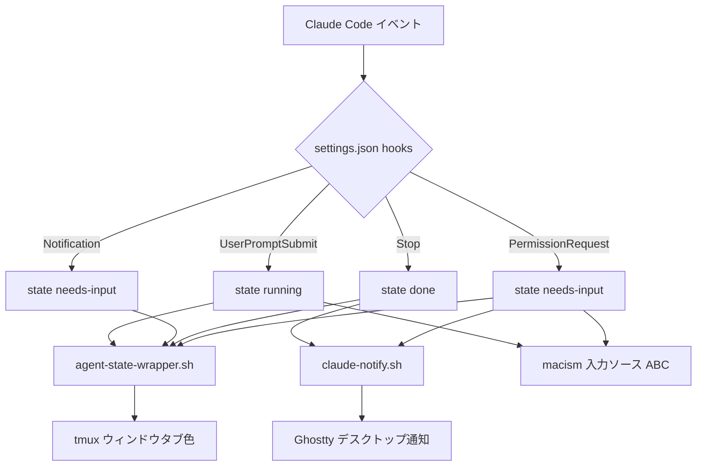
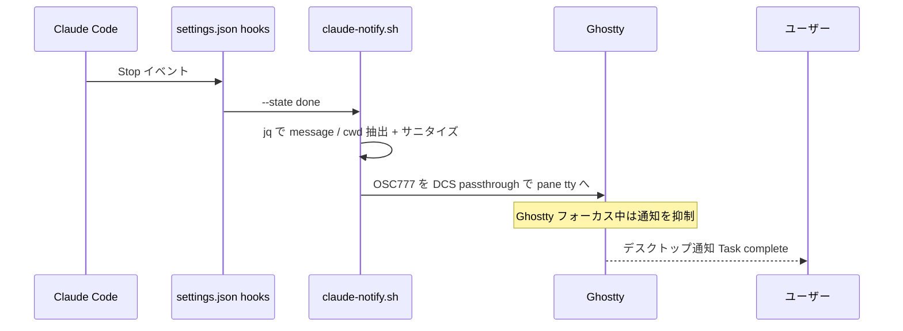
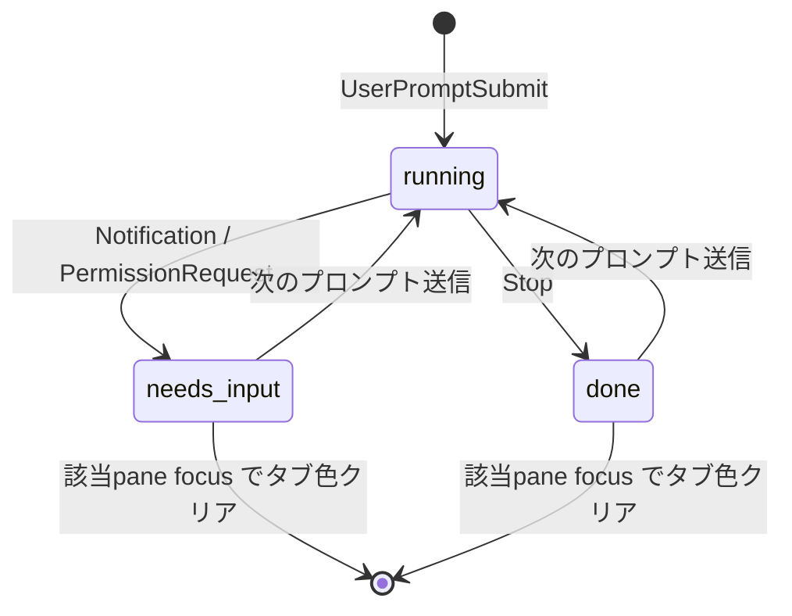
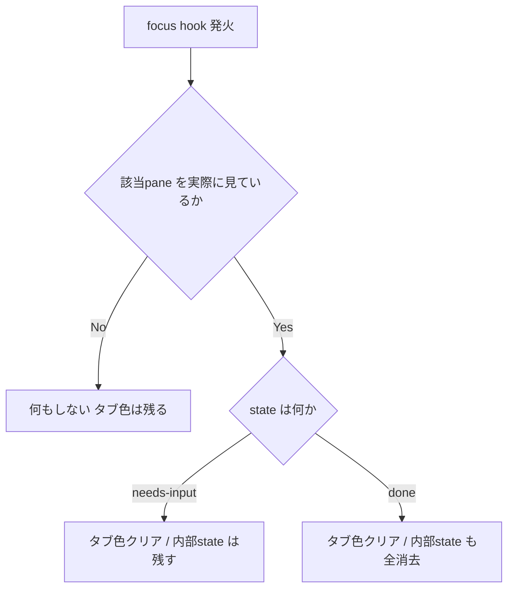

# Claude Code Notifications (tmux on Ghostty)

Claude Code を tmux on Ghostty で使うときの通知を担うスクリプト群。
「いま見ていない作業の完了・入力待ち」を見逃さないことが目的。

> [!NOTE]
> 前提環境: Claude Code 2.1.x / tmux 3.3+ / Ghostty / macOS。
> 通知は Claude Code 本体ではなく、すべて hook 経由でこのスクリプトが出す。

## 全体像

通知は 3 つの出力に分かれる。すべて `dot-claude/settings.json` の
hook がトリガーになる。



役割の住み分けは「Ghostty を見ているか否か」で考えると整理しやすい。

- 見ている時: タブ色で状態把握。デスクトップ通知は Ghostty 側が抑制
- 見ていない時: デスクトップ通知が別アプリ作業中でも引き戻す

## hook とイベントの対応

| hook              | state       | 付随処理                          |
| ----------------- | ----------- | --------------------------------- |
| UserPromptSubmit  | running     | 入力ソースを ABC                  |
| Notification      | needs-input | タブ色のみ                        |
| Stop              | done        | デスクトップ通知                  |
| PermissionRequest | needs-input | デスクトップ通知 + 入力ソース ABC |

`macism` は日本語入力を英数 (ABC) に戻す処理で、通知とは無関係だが
同じ hook に同居している。

> [!NOTE]
> 権限待ちでは Notification と PermissionRequest が両方発火する。
> デスクトップ通知が二重に出るのを避けるため、通知は PermissionRequest に
> 集約し、Notification はタブ色 (視覚) のみ担当させている。idle 入力待ちの
> 通知は逃すが、完了は Stop 通知でカバーされる。

## Setup

ファイルは symlink 方式で管理している。

- `.config/tmux/scripts/` -> `~/.config/tmux/scripts/`
- `dot-claude/settings.json` -> `~/.claude/settings.json`
- `.config/tmux/tmux.conf` -> `~/.config/tmux/tmux.conf`

依存とポイント:

- `tmux` の `allow-passthrough` を有効化（このリポジトリでは `all`）。
  これが無いとデスクトップ通知が外側の Ghostty に届かない
- `jq` (任意): hook の JSON から `.message` / `.cwd` を取り出すのに使う
- Claude Code 本体の通知は `preferredNotifChannel: notifications_disabled`
  でオフにし、通知の責務を hook に一本化している

> [!WARNING]
> settings.json は symlink で即反映されるが、Claude Code は起動時に
> 設定を読む。hook の変更は次回起動セッションから効く。

## Usage

通常は hook 経由で自動的に呼ばれる。手動で叩く場合は以下。

デスクトップ通知のテスト (Ghostty 非フォーカス時のみ表示される):

```sh
echo '{"cwd":"/path/to/proj"}' | bash claude-notify.sh --state done
echo '{"message":"許可待ち"}' | bash claude-notify.sh --state needs-input
```

タブ色の手動セット / 全リセット:

```sh
bash agent-state-wrapper.sh --agent claude --state needs-input
bash ../plugins/tmux-agent-indicator/scripts/reset_all.sh
```

## デスクトップ通知: claude-notify.sh

Claude Code 本体は tmux 内で OSC シーケンスを DCS passthrough で
ラップしないため、ネイティブ通知が外側端末に届かない (issue #19976)。
そこでこのスクリプトが自前で DCS ラップした OSC 777 を pane の tty に
書き込み、Ghostty に通知を出す。



特徴:

- クリックすると Ghostty にフォーカスが戻る (osascript と違い
  AppleScript は起動しない)
- Ghostty がフォーカス中なら Ghostty 側が自動で抑制するため、
  見ている最中は鳴らない
- `;` と制御文字をサニタイズし、OSC シーケンス破壊を防ぐ

> [!NOTE]
> 通知音は macOS の通知設定に従う。スクリプト側では鳴らしていない。

## 視覚通知: tmux-agent-indicator

`agent-state-wrapper.sh` は `tmux-agent-indicator` プラグインの
`agent-state.sh` を呼ぶ薄いラッパー。`select-pane -P` の副作用で
フォーカスが奪われるのを記録 / 復元で打ち消している。

> [!WARNING]
> このリポジトリの tmux.conf では background / border / indicator /
> notification をすべて off にしている。よって実際に見えるのは
> 「ウィンドウタブ (window-status) の色」だけ。pane 境界色や
> ステータスバーアイコンは出ない。

state と見え方:

| state       | ウィンドウタブ | デスクトップ通知 |
| ----------- | -------------- | ---------------- |
| running     | 変化なし       | なし             |
| needs-input | 黄             | あり             |
| done        | 赤             | あり             |

タブ色がつくのは「いま見ていない (非アクティブな) ウィンドウ」だけ。
アクティブなウィンドウには色をつけない。

### 状態遷移



### 色が消えるタイミング

リセットは tmux の 3 つの hook で発火する
(`pane-focus-in` / `after-select-pane` / `after-select-window`)。
ただし発火しても消すには厳しい条件がある。



「実際に見ている」= `pane_active=1` かつ `window_active=1`。
分割 pane で目的の pane を選択せずウィンドウだけ見ても消えない。

needs-input と done の非対称が実用上の落とし穴になる。

- needs-input: focus で見た目は消えるが内部 state は残る。
  ただし indicator を off にしているので、残った state は
  画面には現れない。実質「一度見たら黄色は戻らない」
- done: focus で見た目も内部 state も完全消去。reset-on-focus が
  on なので、完了時点では消さず「見に行くまで赤を保持」する

> [!WARNING]
> 「ちょっと覗いて後回し」をすると、一度 active にした時点で
> タブ色が消えて戻らない。後回しを視認で管理したいなら、その pane を
> active にせず別の手段 (TODO 等) で覚えておくのが安全。

手動でタブ色を戻したいときは needs-input を再セットする。

```sh
bash agent-state-wrapper.sh --agent claude --state needs-input
```

## Claude Code 本体の通知設定 (参考)

`/config` の Notifications 関連は 3 つある。責務が異なる。

- Local notifications (`preferredNotifChannel`): 本体がローカル端末へ
  出す通知。ここでは `notifications_disabled` にして hook に一本化
- Push when actions required: 操作が必要なときスマホへプッシュ。
  Remote Control + Claude モバイルアプリが前提。既定 false
- Push when Claude decides: Claude の判断でスマホへプッシュ。同上

hook はこの設定と独立に動くため、本体通知を切っても hook 通知は出る。

## 設定リファレンス

tmux.conf の現在値 (`@agent-indicator-*`):

- `background-enabled` off
- `border-enabled` off
- `indicator-enabled` off
- `notification-enabled` off
- `reset-on-focus` on

state ごとの色やアニメーションは
`@agent-indicator-<state>-<bg|border|window-title-bg|window-title-fg>`
や `@agent-indicator-animation-enabled` で変更できる。

## 参考

- Claude Code: Configure your terminal
  https://code.claude.com/docs/en/terminal-config
- Claude Code: Settings (preferredNotifChannel)
  https://code.claude.com/docs/en/settings
- Claude Code: Remote Control (Push 通知の基盤)
  https://code.claude.com/docs/en/remote-control
- issue 19976: Support terminal notifications inside tmux
  https://github.com/anthropics/claude-code/issues/19976
- tmux-agent-indicator
  https://github.com/accessd/tmux-agent-indicator
