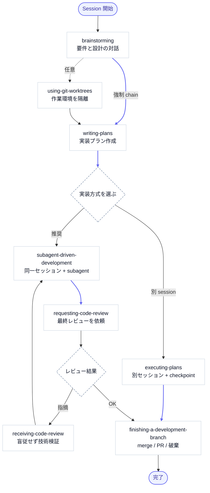
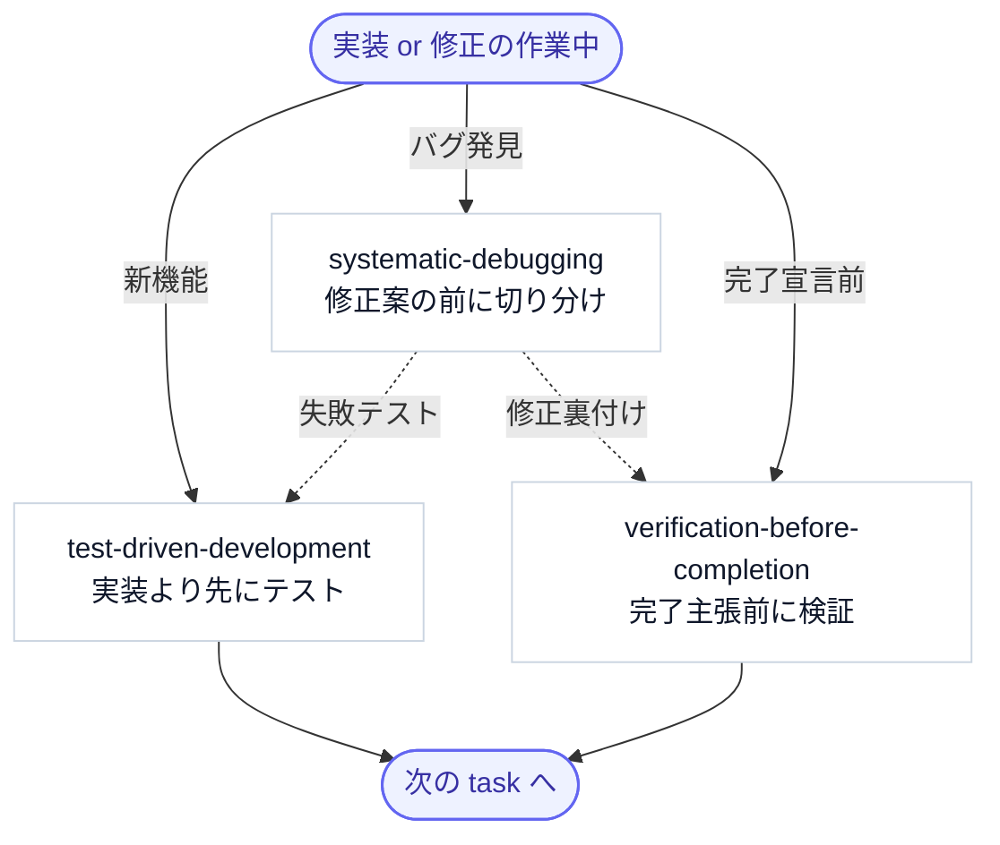
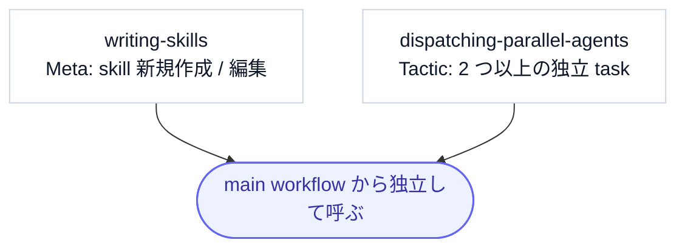

# Superpowers Workflow Flowchart v6.1.1

## Main Workflow

```mermaid
%%{init: {'theme':'base', 'themeVariables': {
  'fontFamily': 'ui-sans-serif, -apple-system, BlinkMacSystemFont, "Segoe UI", sans-serif',
  'fontSize': '14px',
  'lineColor': '#94a3b8',
  'edgeLabelBackground': '#ffffff'
}}}%%
flowchart TD
    START([Session 開始])
    B[brainstorming<br/>要件と設計の対話]
    GW[using-git-worktrees<br/>作業環境を隔離]
    WP[writing-plans<br/>実装プラン作成]
    CH{実装方式を選ぶ}
    SDD[subagent-driven-development<br/>同一セッション + subagent]
    EP[executing-plans<br/>別セッション + checkpoint]
    RCR[requesting-code-review<br/>最終レビューを依頼]
    JG{レビュー結果}
    RVC[receiving-code-review<br/>盲従せず技術検証]
    FIN[finishing-a-development-branch<br/>merge / PR / 破棄]
    END([完了])

    START --> B
    B -.任意.-> GW
    B ==>|強制 chain| WP
    GW --> WP
    WP ==> CH
    CH -->|推奨| SDD
    CH -->|別 session| EP
    SDD ==> RCR
    EP ==> FIN
    RCR --> JG
    JG -->|指摘| RVC
    RVC --> SDD
    JG -->|OK| FIN
    FIN --> END

    linkStyle 2,4,7,8 stroke:#6366f1,stroke-width:2px

    classDef skill fill:#ffffff,stroke:#cbd5e1,stroke-width:1px,color:#0f172a
    classDef terminal fill:#eef2ff,stroke:#6366f1,stroke-width:1.5px,color:#3730a3
    classDef choice fill:#ffffff,stroke:#94a3b8,stroke-width:1.5px,stroke-dasharray:5 3,color:#0f172a
    class B,GW,WP,SDD,EP,RCR,RVC,FIN skill
    class START,END terminal
    class CH,JG choice
```

## Discipline

```mermaid
%%{init: {'theme':'base', 'themeVariables': {
  'fontFamily': 'ui-sans-serif, -apple-system, BlinkMacSystemFont, "Segoe UI", sans-serif',
  'fontSize': '14px',
  'lineColor': '#94a3b8',
  'edgeLabelBackground': '#ffffff'
}}}%%
flowchart TD
    IMPL([実装 or 修正の作業中])
    TDD[test-driven-development<br/>実装より先にテスト]
    SD[systematic-debugging<br/>修正案の前に切り分け]
    VBC[verification-before-completion<br/>完了主張前に検証]
    NEXT([次の task へ])

    IMPL -->|新機能| TDD
    IMPL -->|バグ発見| SD
    IMPL -->|完了宣言前| VBC
    SD -.失敗テスト.-> TDD
    SD -.修正裏付け.-> VBC
    TDD --> NEXT
    VBC --> NEXT

    classDef skill fill:#ffffff,stroke:#cbd5e1,stroke-width:1px,color:#0f172a
    classDef terminal fill:#eef2ff,stroke:#6366f1,stroke-width:1.5px,color:#3730a3
    class TDD,SD,VBC skill
    class IMPL,NEXT terminal
```

## Meta / Tactic

```mermaid
%%{init: {'theme':'base', 'themeVariables': {
  'fontFamily': 'ui-sans-serif, -apple-system, BlinkMacSystemFont, "Segoe UI", sans-serif',
  'fontSize': '14px',
  'lineColor': '#94a3b8',
  'edgeLabelBackground': '#ffffff'
}}}%%
flowchart TD
    WS[writing-skills<br/>Meta: skill 新規作成 / 編集]
    DPA[dispatching-parallel-agents<br/>Tactic: 2 つ以上の独立 task]
    NOTE([main workflow から独立して呼ぶ])

    WS --> NOTE
    DPA --> NOTE

    classDef skill fill:#ffffff,stroke:#cbd5e1,stroke-width:1px,color:#0f172a
    classDef terminal fill:#eef2ff,stroke:#6366f1,stroke-width:1.5px,color:#3730a3
    class WS,DPA skill
    class NOTE terminal
```
