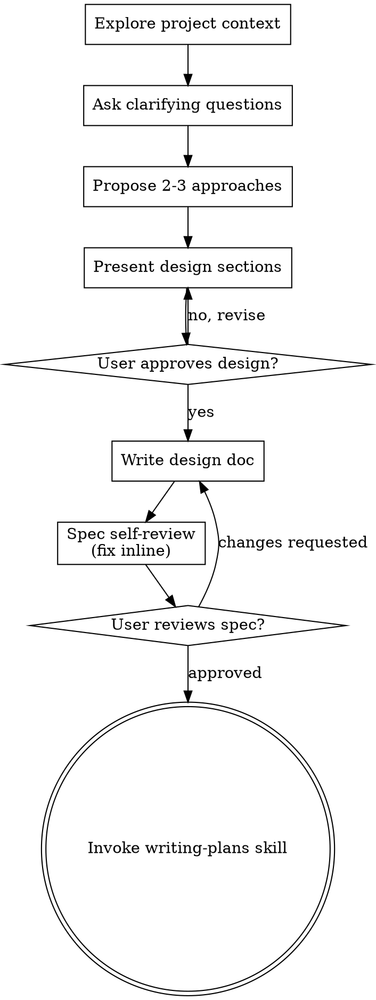

# Brainstorming Ideas Into Designs

自然な対話を通して、思い付きを完成した設計と仕様に育てよ。

まず今の project の文脈を掴め。次に一度に一つずつ質問し、考えを磨け。何を作るのか分かったら、設計を示して `user` の承認を得よ。

<HARD-GATE>
設計を示し `user` が承認するまでは、implementation skill を起動するな。code を書くな。project の骨組みを作るな。実装に当たる行動を取るな。単純に見えるかどうかに関わらず、全ての project に当てはまる。
</HARD-GATE>

## Anti-Pattern: 「これは単純すぎて設計は要らない」

全ての project がこの過程を通る。todo list も、関数一つの utility も、config の変更もだ。「単純な」project こそ、検討されない前提が最も多くの無駄を生む。設計は短くてよい (本当に単純な project なら数文でよい)。しかし必ず示し、承認を得よ。

## Checklist

以下の各項目について task を作り、順に完了させよ。

1. project の文脈を調べる — file、文書、最近の commit を確認する
2. visual companion をその場で提案する — 先回りして提案するな。説明するより見せた方が明らかに分かりやすい質問が初めて現れたときに、そこで提案せよ (独立した message として)。承認されれば browser tab が開く。視覚的な質問が一度も現れないなら、決して提案するな。下の Visual Companion 節を見よ。
3. 確認の質問をする — 一度に一つずつ。目的、制約、成功の基準を掴む
4. 案を 2〜3 個示す — 得失と自分の推薦を添える
5. 設計を示す — 複雑さに応じた分量の節に分け、節ごとに `user` の承認を得る
6. 設計文書を書く — `docs/superpowers/specs/YYYY-MM-DD-<topic>-design.md` に保存し commit する
7. 仕様の自己 review — 穴、矛盾、曖昧さ、範囲をその場で素早く確認する (下を見よ)
8. `user` が書かれた仕様を review する — 先へ進む前に仕様 file の確認を頼む
9. 実装へ移る — writing-plans skill を起動し、実装計画を作る

## Process Flow

終端の状態は writing-plans の起動だ。frontend-design、mcp-builder、その他の implementation skill を起動するな。brainstorming の後に起動してよい唯一の skill は writing-plans だ。

## The Process

考えを掴む:

- まず今の project の状態を確認せよ (file、文書、最近の commit)
- 細かい質問に入る前に、規模を測れ。依頼が独立した subsystem を複数含むなら (例: 「chat と file 保管と課金と分析を備えた platform を作る」)、すぐにそれを指摘せよ。先に分割すべき project の細部を、質問で詰めるな
- 一つの仕様に収まらないほど大きいなら、`user` と一緒に sub-project へ分けよ。独立した塊は何か、互いにどう関わるか、どの順で作るか。その上で最初の sub-project を通常の設計の流れで brainstorming せよ。sub-project ごとに 仕様 → 計画 → 実装 の周期を持つ
- 規模が適切な project なら、一度に一つずつ質問して考えを磨け
- できれば選択式の質問を選べ。自由記述でも構わない
- message ごとに質問は一つだけ。もっと掘るべき論点なら、複数の質問に分けよ
- 目的、制約、成功の基準を掴むことに集中せよ

案を探る:

- 得失を添えて、異なる案を 2〜3 個示せ
- 会話の流れで示し、推薦とその理由を添えよ
- 推薦する案を先に出し、理由を説明せよ
- YAGNI を徹底せよ。どの案からも、どの設計からも、不要な機能を削れ

設計を示す:

- 何を作るのか分かったと思えたら、設計を示せ
- 節ごとに複雑さに応じた分量にせよ。単純なら数文、込み入っているなら 200〜300 語まで
- 節ごとに、ここまでの内容が正しいか尋ねよ
- 扱う範囲: 構成、component、data の流れ、error 処理、test
- 筋が通らない点があれば、戻って明確にする用意をせよ

隔離と明快さのための設計:

- 系を小さな単位に分けよ。各単位は目的を一つだけ持ち、明確な interface で通信し、独立して理解でき test できること
- 各単位について、次に答えられること。何をするか、どう使うか、何に依存するか
- 内部を読まずに、その単位が何をするか分かるか。consumer を壊さずに内部を変えられるか。できないなら、境界の引き方に手を入れよ
- 小さく境界の明確な単位は、あなた自身にとっても扱いやすい。一度に context へ収まる code の方がうまく推論でき、file の焦点が絞られているほど編集は確実になる。file が大きくなったら、多くを抱えすぎている合図だ

既存の codebase で作業する:

- 変更を提案する前に今の構造を調べよ。既存の書き方に従え
- 作業に影響する問題が既存の code にあるなら (肥大した file、不明瞭な境界、絡み合った責務など)、的を絞った改善を設計に含めよ。良い開発者が自分の触る code を良くするのと同じだ
- 無関係な refactoring を提案するな。今の目的に資することに集中せよ

## After the Design

文書:

- 検証済みの設計 (仕様) を `docs/superpowers/specs/YYYY-MM-DD-<topic>-design.md` に書け
  - (仕様の置き場所について `user` の好みがあれば、この既定より優先する)
- elements-of-style:writing-clearly-and-concisely skill があれば使え
- 設計文書を git に commit せよ

仕様の自己 review:
仕様文書を書いたら、新しい目で見直せ。

1. 穴の走査: 「TBD」「TODO」、書きかけの節、曖昧な要件は無いか。直せ
2. 内部の整合: 互いに矛盾する節は無いか。構成は機能の説明と合っているか
3. 範囲の確認: 一つの実装計画に収まるほど絞れているか。分割が要るか
4. 曖昧さの確認: 二通りに読める要件は無いか。あるなら一方を選び、明示せよ

見つけた問題はその場で直せ。再 review は要らない。直して先へ進め。

`user` の review という関門:
仕様の review が通ったら、先へ進む前に `user` に書かれた仕様の確認を頼め。

> 「仕様を書き、`<path>` に commit しました。確認をお願いします。実装計画を書き始める前に変えたい点があれば教えてください。」

`user` の返答を待て。変更を求められたら直し、仕様の review をやり直せ。`user` が承認して初めて先へ進め。

実装:

- writing-plans skill を起動し、詳細な実装計画を作れ
- 他の skill を起動するな。次の step は writing-plans だ

## Visual Companion

brainstorming の最中に mockup、図、視覚的な選択肢を見せるための、browser を使う補助だ。これは mode ではなく tool だ。承認されたということは、視覚的に扱った方がよい質問でこれを使えるという意味であって、全ての質問を browser で行うという意味ではない。

companion の提案 (その場で): 先回りして提案するな。語るより見せた方が明らかに分かりやすい質問が来るまで待て。単に UI という話題であるだけでは足りず、実際の mockup / layout / 図の質問であること。それが初めて起きたときに、独立した message として提案せよ。

> 「この先は見せた方が分かりやすいかもしれません。browser tab に mockup や図や比較を作りながら進められます。まだ新しい機能で、token を多く使います。使いますか。開きます。」

この提案は必ず独立した message にせよ。提案だけを書き、確認の質問や要約その他を混ぜるな。`user` の返答を待て。承認されたら `--open` 付きで server を起動し、最初の画面が自動で browser に開くようにせよ。断られたら文字だけで続け、`user` が持ち出さない限り再び提案するな。

質問ごとの判断: `user` が承認した後も、質問ごとに browser を使うか terminal を使うか決めよ。判定はこうだ。読むより見る方が `user` はよく理解できるか。

- browser を使うのは、中身が視覚的なとき — mockup、wireframe、layout の比較、構成図、並べて見せる視覚的な設計
- terminal を使うのは、中身が文字のとき — 要件の質問、概念の選択、得失の一覧、A/B/C/D の文字の選択肢、範囲の判断

UI に関する質問が、自動的に視覚的な質問になるわけではない。「この文脈で personality とは何を指すか」は概念の質問だ。terminal を使え。「どちらの wizard layout が良いか」は視覚的な質問だ。browser を使え。

companion を使うことになったら、進める前に詳細な手引きを読め。
`skills/brainstorming/visual-companion.md`
