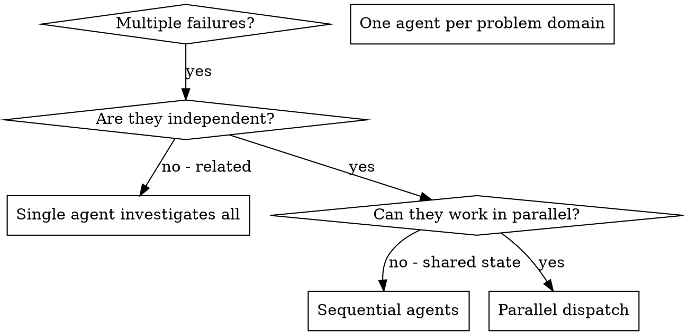

# Dispatching Parallel Agents

## Overview

あなたは task を、隔離された context を持つ専門の agent へ委ねる。指示と文脈を正確に組み立てることで、agent は焦点を保ち、task をやり遂げる。agent はあなたの session の context や履歴を受け継いではならない。必要なものだけをあなたが組み立てる。これは、調整の作業に使うあなた自身の context も守る。

無関係な失敗が複数あるとき (別々の test file、別々の subsystem、別々の bug)、順に調べるのは時間の無駄だ。調査はそれぞれ独立していて、並列に進められる。

核となる原則: 独立した問題領域ごとに agent を一つ起動せよ。同時に働かせよ。

## When to Use



使うとき:
- 根本原因の異なる test file が 3 つ以上落ちている
- 複数の subsystem が別々に壊れている
- 各問題を、他の文脈なしで理解できる
- 調査の間に共有する状態が無い

使わないとき:
- 失敗が互いに関係している (一つ直せば他も直るかもしれない)
- 系の全体像を掴む必要がある
- agent どうしが干渉する

## The Pattern

### 1. 独立した領域を見極める

何が壊れているかで失敗を束ねよ。
- file A の test: tool の承認の流れ
- file B の test: 一括完了の振る舞い
- file C の test: 中断の機能

各領域は独立している。tool の承認を直しても、中断の test には影響しない。

### 2. 焦点の絞られた agent の task を作る

各 agent に渡すもの:
- 具体的な範囲: test file か subsystem を一つ
- 明確な目標: この test を通すこと
- 制約: 他の code を変えるな
- 期待する出力: 何を見つけ、何を直したかの要約

### 3. 並列に起動する

三つの subagent の起動を同じ応答で出せ。並列に走る。

```text
Subagent (general-purpose): "Fix agent-tool-abort.test.ts failures"
Subagent (general-purpose): "Fix batch-completion-behavior.test.ts failures"
Subagent (general-purpose): "Fix tool-approval-race-conditions.test.ts failures"
# All three run concurrently.
```

一つの応答で複数起動 = 並列実行。応答ごとに一つ = 逐次実行。

### 4. 確認して統合する

agent が返ってきたら:
- 各要約を読む
- 修正が衝突しないか確かめる
- test 一式を丸ごと実行する
- 全ての変更を統合する

## Agent Prompt Structure

良い agent の prompt はこうだ。
1. 焦点が絞られている — 問題領域は一つ
2. 自己完結している — 問題の理解に必要な文脈が全て揃っている
3. 出力が具体的 — agent は何を返すべきか

```markdown
Fix the 3 failing tests in src/agents/agent-tool-abort.test.ts:

1. "should abort tool with partial output capture" - expects 'interrupted at' in message
2. "should handle mixed completed and aborted tools" - fast tool aborted instead of completed
3. "should properly track pendingToolCount" - expects 3 results but gets 0

These are timing/race condition issues. Your task:

1. Read the test file and understand what each test verifies
2. Identify root cause - timing issues or actual bugs?
3. Fix by:
   - Replacing arbitrary timeouts with event-based waiting
   - Fixing bugs in abort implementation if found
   - Adjusting test expectations if testing changed behavior

Do NOT just increase timeouts - find the real issue.

Return: Summary of what you found and what you fixed.
```

## Common Mistakes

❌ 広すぎる: 「test を全部直して」— agent は迷子になる
✅ 具体的: 「agent-tool-abort.test.ts を直して」— 範囲が絞られている

❌ 文脈が無い: 「その競合状態を直して」— agent には場所が分からない
✅ 文脈がある: error message と test 名を貼る

❌ 制約が無い: agent が何もかも refactoring しかねない
✅ 制約がある: 「production の code を変えるな」「test だけ直せ」

❌ 出力が曖昧: 「直して」— 何が変わったか分からない
✅ 具体的: 「根本原因と変更点の要約を返せ」

## When NOT to Use

関係する失敗: 一つ直せば他も直るかもしれない。まず一緒に調べよ
全体の文脈が要る: 理解には系全体を見る必要がある
手探りの debug: 何が壊れているかまだ分かっていない
共有する状態: agent どうしが干渉する (同じ file を編集する、同じ資源を使う)

## Real Example from Session

状況: 大きな refactoring の後、3 つの file にまたがって 6 件の test が落ちた

失敗:
- agent-tool-abort.test.ts: 3 件 (timing の問題)
- batch-completion-behavior.test.ts: 2 件 (tool が実行されない)
- tool-approval-race-conditions.test.ts: 1 件 (実行回数 = 0)

判断: 独立した領域だ。中断の論理、一括完了、競合状態はそれぞれ別物だ

起動:
```
Agent 1 → Fix agent-tool-abort.test.ts
Agent 2 → Fix batch-completion-behavior.test.ts
Agent 3 → Fix tool-approval-race-conditions.test.ts
```

結果:
- Agent 1: timeout を event 基準の待機に置き換えた
- Agent 2: event の構造の bug を直した (threadId の位置が誤っていた)
- Agent 3: 非同期の tool 実行の完了を待つ処理を足した

統合: 修正は全て独立していて衝突なし。test 一式が緑になった

## Verification

agent が返ってきたら:
1. 各要約を確認する — 何が変わったか掴む
2. 衝突を確かめる — agent どうしが同じ code を編集していないか
3. test 一式を丸ごと実行する — 修正が揃って働くか確かめる
4. 抜き取りで確かめる — agent は同じ誤りを組織的に犯すことがある
