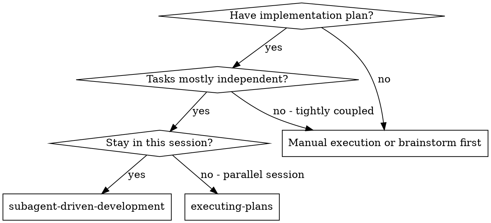
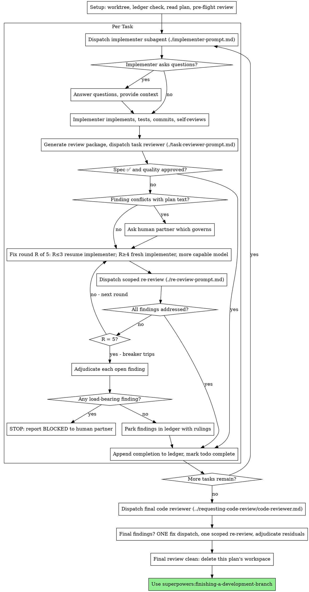

# Subagent-Driven Development

計画を実行せよ。task ごとに新しい implementer subagent を起動する。task ごとに review (仕様への適合 + code の品質) を挟む。最後に branch 全体の広い review を行う。

なぜ subagent か: あなたは task を、隔離された context を持つ専門の agent へ委ねる。指示と文脈を正確に組み立てることで、agent は焦点を保ち、task をやり遂げる。agent はあなたの session の context や履歴を受け継いではならない。必要なものだけをあなたが組み立てる。これは、調整の作業に使うあなた自身の context も守る。

核となる原則: task ごとに新しい subagent + task の review (仕様 + 品質) + 最後の広い review = 高い品質と速い反復

語り: tool の呼び出しの間に語るのは、短い一行までにせよ。記録は台帳と tool の結果が担う。

止まらずに実行せよ: task の合間に、人間の相棒への確認で止まるな。計画の全ての task を止まらずに実行せよ。止まってよいのは、自分で解けない BLOCKED、本当に進行を妨げる曖昧さ、全 task の完了のときだけだ。「続けますか」の問い掛けや途中経過の要約は、相棒の時間を奪う。相棒は計画の実行を頼んだのだから、実行せよ。

## When to Use



Executing Plans (別 session) との違い:
- 同じ session (context の切り替えが無い)
- task ごとに新しい subagent (context の汚染が無い)
- task ごとに review (仕様への適合 + code の品質)、最後に広い review
- 速い反復 (task の合間に人間を挟まない)

## The Process



## Setup

作業が隔離した workspace で行われるようにせよ。superpowers:using-git-worktrees で作るか、既存のものを確かめよ。人間の相棒の明示的な同意なしに、main/master branch で実装を始めるな。

会話の記憶は圧縮を越えて残らない。実際の session では、位置を見失った controller が、完了済みの task 列を丸ごと再起動したことがある。観測された中で最も高くついた失敗だ。進捗は todo だけでなく、台帳 file で追え。

- 計画ごとに workspace を持つ。skill の開始時に、この skill の `scripts/sdd-workspace PLAN_FILE` を実行せよ。その計画の git-ignore された directory (`<repo-root>/.superpowers/sdd/<plan-basename>/`) を出力する。この計画の成果物は全てそこに置く。台帳、brief、報告、review package だ。他の計画の directory を読むことも書くこともあなたの役目ではない
- この計画の台帳を `<workspace>/progress.md` で探せ。最初の行があなたの計画 file を指しているなら、`Task <N>: complete` の行がある task は完了だ。再起動するな。その行が無い最初の task から再開せよ。最後の行が fix round の task は loop の途中だ。次の round から loop を再開せよ。最初の行が別の計画 file を指す台帳や、古い平坦な path `.superpowers/sdd/progress.md` に残った台帳は、別の計画の進捗だ。そのまま残し、自分の台帳を新しく始めよ
- 台帳は、最初の行に身元を書いて作れ: `# SDD ledger — plan: <plan file path>`
- 台帳はあなたの復旧地図だ。そこに名指しされた commit は、あなたの context がもう作った記憶を持たなくても git に存在する。圧縮の後は、自分の記憶より台帳と `git log` を信じよ
- `git clean -fdx` は workspace を消す (git-ignore された作業場だからだ)。そうなったら `git log` から復旧せよ

計画は一度だけ読み、その文脈と Global Constraints を控え、task ごとに todo を作れ。

Task 1 を起動する前に、計画を一度走査して矛盾を探せ。

- 互いに矛盾する task、または計画の Global Constraints と矛盾する task
- 計画が明示的に求めているのに、review の基準では欠陥と扱われるもの (何も assert しない test、論理の塊の逐語的な重複)

見つけたものは全て、一つにまとめた質問として人間の相棒に示せ。それを求めている計画の文言を各項目に添え、どちらが優先するか尋ねよ。実行を始める前にだ。計画の途中で見つけるたびに割り込むのではない。走査で何も出なければ、何も言わず進め。実装して初めて現れる矛盾は、review の loop が受け止める。

## Model Selection

役割ごとに、こなせる中で最も非力な model を使え。費用を抑え、速さを上げるためだ。

機械的な実装の task (独立した関数、明確な仕様、file 1〜2 個): 速くて安い model を使え。計画がよく書けていれば、実装の task はたいてい機械的だ。

統合や判断の task (複数 file の調整、型の当てはめ、debug): 標準の model を使え。

構成や設計の task: 使える中で最も高性能な model を使え。最後の branch 全体の review はこれに当たる。session の既定ではなく、使える中で最も高性能な model で起動せよ。

review の task: 同じ判断で選べ。diff の大きさ、複雑さ、危険度に応じて決める。小さく機械的な diff に最高性能の model は要らない。微妙な並行性の変更には要る。小さな修正 diff への範囲を絞った再 review は、安価から中位の階層でよい。

fix loop の格上げ (round 4〜5): 詰まった implementer より少なくとも一階層上の model を使え。

subagent を起動するときは、常に model を明示せよ。省くと session の model を受け継ぐ。多くは最も高性能で最も高価な model であり、この節の意味が静かに失われる。

turn の回数は token の単価に勝る。所要時間と context の費用は、subagent が費やす turn の数に比例する。最も安い model は、複数 step の作業で 2〜3 倍の turn を要することが多く、結局は高くつく。reviewer と、散文の説明から作る implementer には、中位の model を下限とせよ。task の計画文に書くべき code が丸ごと入っているなら、実装は書き写しと test だ。その implementer には最も安い階層を使え。単一 file の機械的な修正も最も安い階層でよい。

task の複雑さの目安 (実装の task):
- 完全な仕様があり file 1〜2 個 → 安い model
- 複数 file にまたがり統合の考慮が要る → 標準の model
- 設計の判断や codebase の広い理解が要る → 最も高性能な model

## The Task Loop

起動の prompt に貼ったもの、そして subagent が返してきたものは、その session の残りの間ずっとあなたの context に残り、後の turn ごとに読み直される。成果物は file として渡せ。

### 1. implementer を起動する

起動の前に BASE (`git rev-parse HEAD`) を控えよ。review package と fix round の diff に要る。

- task の brief: implementer を起動する前に、この skill の `scripts/task-brief PLAN_FILE N` を実行せよ。その task の全文を、一意な名前の file に取り出し、path を出力する。brief が要件の唯一の出所であり続けるように起動文を組め。起動文に含めるものはこうだ。(1) この task が project のどこに位置するかの一行。(2) brief の path。「まずこれを読め。これがあなたの要件で、使うべき正確な値がそのまま書かれている」と添えよ。(3) brief には分からない、前の task の interface と決定事項。(4) brief で気付いた曖昧さについてのあなたの解決。(5) 報告 file の path と報告の約束事。正確な値 (数値、特別な文字列、署名、test の場合) は brief にだけ書く。subagent に計画 file を丸ごと読ませるな
- 報告 file: implementer の報告 file は brief に合わせて名付けよ (brief `…/task-N-brief.md` → 報告 `…/task-N-report.md`)。起動の prompt にその path を入れよ。implementer は完全な報告をそこに書き、返すのは状態、commit、test の一行の要約、懸念だけだ
- 起動の prompt は一つの task を述べるものであって、session の履歴ではない。積み上がった前の task の要約 (「Task 1〜3 の後の状態」) を後の起動文に貼るな。実際の session では、起動文が 42k 文字に達し、その 99% が貼られた履歴だった。新しい subagent に要るのは、自分の task、触る interface、全体の制約だけだ。それ以外は要らない
- 前の task がこの task の触る領域に findings を保留していたなら、その台帳の項目への案内を起動文に入れよ
- 起動の結果から implementer の agent の身元を控えよ。fix loop の round 1〜3 はこの agent を再開する
- 実装の subagent を並列に起動するな (衝突する)

template: [implementer-prompt.md](implementer-prompt.md)

### 2. 報告を扱う

implementer subagent は 4 つの状態のどれかで報告する。それぞれ適切に扱え。

DONE: review package を作り (`scripts/review-package PLAN_FILE BASE HEAD`。この skill の directory から実行する。書き出した一意な file の path を出力する。BASE は implementer を起動する前に控えた commit だ。`HEAD~1` を使うな。複数 commit の task で最後の一つ以外を静かに落とす)、出力された path を渡して task reviewer を起動せよ。

DONE_WITH_CONCERNS: implementer は作業を終えたが疑念を挙げている。進む前に懸念を読め。正しさや範囲についての懸念なら、review の前に手を入れよ。単なる所見なら (例:「この file は大きくなってきた」)、控えた上で review へ進め。

NEEDS_CONTEXT: implementer に渡されなかった情報が要る。足りない文脈を渡し、起動し直せ。

BLOCKED: implementer が task を完了できない。原因を見極めよ。
1. 文脈の問題なら、文脈を足して同じ model で起動し直す
2. より深い推論が要るなら、より高性能な model で起動し直す
3. task が大きすぎるなら、小さく分ける
4. 計画そのものが誤っているなら、人間に上げる

上申を無視するな。何も変えずに同じ model に再試行させるな。implementer が詰まったと言うなら、何かを変える必要がある。

implementer が質問してきたら — 始める前でも途中でも — 明確に最後まで答え、必要なら文脈を足し、急かして実装へ押し込むな。

### 3. task を review する

task ごとの review は、その task に範囲を絞った関門だ。広い review は最後の branch 全体の review で一度だけ行う。task の review を飛ばすな。どちらかの判定を欠いた報告を受け入れるな。仕様への適合と task の品質は、両方とも要る。implementer の自己 review は task の review の代わりにならない。両方が要る。

- reviewer には diff を file で渡せ。この skill の `scripts/review-package PLAN_FILE BASE HEAD` を実行し、出力された file の path を渡せ (bash が無いなら、その範囲の `git log --oneline`, `git diff --stat`, `git diff -U10` を、一意な名前の file 一つにまとめて出せ)。その出力はあなた自身の context には入らず、reviewer は commit の一覧、統計の要約、文脈付きの完全な diff を、一度の Read で見られる。BASE は implementer を起動する前に控えたものを使え。`HEAD~1` は使うな。複数 commit の task を静かに切り詰める。diff の file 無しに task reviewer を起動するな
- reviewer への入力: task reviewer は 3 つの path を受け取る。同じ brief file、報告 file、review package だ。加えて、その task を縛る全体の制約を渡す
- reviewer に渡す全体の制約の塊は、reviewer の注意を向ける lens だ。計画の Global Constraints の節か仕様から、拘束力のある要件をそのまま写せ。正確な値、正確な形式、component 間の関係の明示 (「X と同じ配置」「Y と一致する」)。reviewer の template には、既に進め方の規則 (YAGNI、test の衛生、review の方法) が入っている。制約の塊は、この project の仕様が求めるもののためにある
- 具体的で task に固有の理由なしに、「全ての利用箇所を確認せよ」「必要なら競合の test を実行せよ」のような漠然とした指示を足すな
- implementer が同じ code で既に実行した test を、reviewer に再実行させるな。test の証拠は implementer の報告が持っている
- reviewer に代わって findings を予断するな。特定の問題を無視せよ、挙げるな、と reviewer に指示するな。誤検知になると思うなら、reviewer に挙げさせ、review の loop で裁定せよ。書いている prompt に「挙げるな」「X を欠陥として扱うな」「最大でも Minor」「計画がそう決めた」が入っているなら、止まれ。あなたは予断している。たいていは自分が review の loop を避けたいがためだ

task reviewer は「⚠️ diff からは確かめられない」項目を報告することがある。変更されていない code にある要件や、task をまたぐ要件だ。これは review の残りを止めないが、task を完了とする前に、あなた自身が一つずつ片付けなければならない。reviewer には無い計画と task 横断の文脈を、あなたは持っている。本当に穴だと確認したなら、仕様の review の失敗として扱え。他の findings と共に fix loop へ入る。

template: [task-reviewer-prompt.md](task-reviewer-prompt.md)

### 4. fix loop

loop が動くのは、review が仕様 ❌ を報告したとき、Critical か Important の findings があるとき、あなたが本当に穴だと確認した ⚠️ 項目があるときだ。

loop が始まる前に、そこから直ちに外れる道が二つある。

- Minor の findings は、その都度 進捗の台帳へ記録せよ (`Task <N>: minor (deferred): <一行>`)。そして最後の branch 全体の review にその一覧を指し示し、merge の前に直すべきものを選り分けさせよ。誰も読まない集計は、静かな切り捨てだ。Minor は loop に入れない
- 「計画が求めている」と札の付いた findings、あるいは計画の文言と衝突する findings は、他の計画の矛盾と同じく人間の判断だ。findings と計画の文言を示し、どちらが優先するか尋ねよ。計画が求めているからと findings を退けるな。尋ねずに、計画と矛盾する修正を起動するな

それ以外は loop に入る。fix の 1 round は、修正の起動一回と、範囲を絞った再 review 一回だ。task ごとに最大 5 round。

round 1〜3 — 元の implementer を再開せよ。未解決の findings をそのまま送れ。その context は保たれている。task も code も自分の選択も知っている。生きている subagent に追加の message を送れない harness なら、新しい implementer を起動せよ。brief の path、報告 file の path、findings を持たせる。どちらにせよ、報告 file が持続する記憶だ。

round 4〜5 — より高性能な model で新しい implementer を起動せよ (Model Selection に従う)。brief の path、報告 file の path、未解決の findings、そしてこの前置きを渡せ: 「前の implementer がこの task を [N] 回試みた。今はあなたの担当だ。何を試したかは報告 file を読め。」3 回の再開を生き延びた loop は、たいてい implementer が自分の問題を見られないことを意味する。新しい目と能力の底上げを一度に行う。

どちらの道でも、毎 round こうなる。implementer が直し、変えた code を覆う test を実行し直す。同じ報告 file に修正の報告を追記し、短い形式で返す。reviewer を起動し直す前に、修正の報告に、覆う test、実行した command、その出力が入っていることを確かめよ。3 つが揃って初めて再 review を起動せよ。覆う test の file 名を修正の依頼で名指しせよ。一行の修正に test 一式は要らない。

再 review は範囲を絞る。`scripts/review-package PLAN_FILE FIX_BASE HEAD` を実行せよ。FIX_BASE は前の review が見た head だ。findings の一覧、brief、報告 file、出力された diff の path を添えて [re-review-prompt.md](re-review-prompt.md) を起動せよ。再 reviewer は findings ごとに ADDRESSED か NOT ADDRESSED を判定し、修正 diff の中の新しい破損だけを挙げる。修正 diff の中の新しい Critical/Important の破損は、未解決の findings の一覧に加わる。範囲の外の所見は、先送りの minor として台帳へ回る。loop を延ばすことは無い。

各 round の後、台帳に追記せよ:
`Task <N>: fix round <R>/5 (<X> addressed, <Y> open — <finding の一行>; commits <a7>..<b7>)`

controller の session で findings を自分で直すな。あなたの context は調整のために綺麗に保たれ、controller の修正は review を通らない。

遮断器: round 5 の再 review でもなお findings が残るなら、起動をやめよ。未解決の findings を一つずつ、あなた自身が裁定せよ。reviewer には無い計画と task 横断の文脈を、あなたは持っている。

- reviewer が誤っている、または議論の余地がある: 保留せよ — `Task <N>: parked — <finding> — ruling: <なぜこの code のままでよいか>`。最後の review が双方を見る
- 本当だが、下流が何も依存していない: 同じように保留せよ。本当だが先送りする、という裁定を添える
- 本当で、かつ支えになっている — 後の task がその上に作る、あるいは計画の欠陥を明かす: 止まれ。`Task <N>: BLOCKED — <理由>` を追記し、findings と、それが衝突する計画の文言と、修正の履歴を添えて人間の相棒に報告せよ。構造的な失敗を保留すると、依存する task が全てその上に積まれ、最後の review も直せない問題を渡されることになる

裁定は上限に達したときだけだ。loop を終わらせるために早く裁定するのは、名を変えた予断だ。裁定は必ず台帳の項目になる。静かな切り捨ては禁じる。

### 5. task を完了する

review が綺麗に返ったとき — または上限で全ての未解決 findings が裁定付きで保留されたとき — 他の記録と同じ message で、完了の行を台帳に追記せよ。

- `Task <N>: complete (commits <base7>..<head7>, review clean)`
- 遮断器が働いた後は `Task <N>: complete (commits <base7>..<head7>, <K> parked)`

その上で todo を完了にし、先へ進め。Critical/Important の未解決の問題が、直されても、上限で裁定付きに保留されてもいないまま、次の task へ移るな。

## Final Review

最後の branch 全体の review にも package を渡す。`scripts/review-package PLAN_FILE MERGE_BASE HEAD` を実行し (MERGE_BASE は branch が始まった commit。例: `git merge-base main HEAD`)、出力された path を最後の review の起動文に入れよ。最後の reviewer は git command で branch の diff を導き直さず、file 一つを読めばよくなる。使える中で最も高性能な model で起動せよ (Model Selection を見よ)。superpowers:requesting-code-review の [code-reviewer.md](../requesting-code-review/code-reviewer.md) を使え。台帳の先送りの minor と保留の行を指し示し、merge の前に直すべきものを選り分けさせよ。

最後の branch 全体の review が findings を返したら、findings の一覧を丸ごと持たせた修正の subagent を一つだけ起動せよ。findings ごとに修正役を立てるな。findings ごとの修正役は、それぞれが context を組み直し test 一式を回し直す。実際の session では、最後の review の修正の波が、全 task の合計より高くついた。その上で、修正の波に対する範囲を絞った再 review をちょうど一回実行せよ (修正の範囲に対する `scripts/review-package PLAN_FILE FIX_BASE HEAD` と [re-review-prompt.md](re-review-prompt.md))。残った findings は task の loop の遮断器と同じく裁定せよ。裁定付きで保留するか、支えになっているものでは止まる。修正の波は二度目が無い。支えになっている残りの findings は、finishing-a-development-branch が選択肢を示すときに人間の相棒へ上がる。

## Finish

最後の branch 全体の review が綺麗になり、その修正が取り込まれたら、この計画の workspace を消せ (`rm -rf <workspace>`)。記録は git の履歴が担う。隣の directory は他の計画のものだ。触るな。

superpowers:finishing-a-development-branch を使え。

## Common Rationalizations

| 言い訳 | 実際 |
|--------|---------|
| 「仕様への適合はだいたい足りている」 | reviewer が仕様の穴を見つけた = 未完了だ。直すか、上限に達して裁定するか。出口はそれだけだ。 |
| 「自分で直す。起動は手間だ」 | controller の修正は context を汚し、review を通らない。implementer を再開せよ。 |
| 「あと 1 round で収束する」 | 上限を越えた round は収束しない。失敗は構造的だ。裁定して振り分けよ。 |
| 「どうせ reviewer はまた何か見つける」 | 範囲を絞った再 review は修正を確かめるだけで、さまよえない。触っていない code の新しい findings は loop ではなく台帳へ行く。 |
| 「この findings は明らかに誤りだ。落とそう」 | 裁定は上限に達したときだけで、全ての裁定は台帳の項目になる。静かな切り捨ては禁じる。 |
| 「修正は小さい。再 review は飛ばそう」 | review されない修正から回帰が入り込む。全ての round は範囲を絞った再 review で終わる。 |
| 「review は loop を遅くする」 | review の無い loop は、確かめられていない空回りだ。review が loop の brake であり舵だ。 |
| 「台帳の記録は手間だ」 | 台帳は圧縮を越えて残るものだ。台帳を持たない controller は、完了済みの task 列を丸ごと再起動した。 |

## Example Workflow

```
You: I'm using Subagent-Driven Development to execute this plan.

[Setup: worktree verified]
[Read plan file once: docs/superpowers/plans/feature-plan.md]
[Resolve workspace: scripts/sdd-workspace docs/superpowers/plans/feature-plan.md — no ledger inside, fresh start]
[Create todos for all tasks]

Task 1: Hook installation script

[Run task-brief for Task 1; dispatch implementer with brief + report paths + context]

Implementer: "Before I begin - should the hook be installed at user or system level?"

You: "User level (~/.config/superpowers/hooks/)"

Implementer: [Later]
  - Implemented install-hook command
  - Added tests, 5/5 passing
  - Self-review: Found I missed --force flag, added it
  - Committed

[Run review-package PLAN_FILE BASE HEAD; dispatch task reviewer with the printed path]
Task reviewer: Spec ✅ - all requirements met, nothing extra.
  Strengths: Good test coverage, clean. Issues: None. Task quality: Approved.

[Ledger: Task 1: complete (commits a1b2c3d..d4e5f6a, review clean)]

Task 2: Recovery modes

[Run task-brief for Task 2; dispatch implementer with brief + report paths + context]

Implementer: [No questions]
  - Added verify/repair modes
  - 8/8 tests passing
  - Committed

[Run review-package PLAN_FILE BASE HEAD; dispatch task reviewer with the printed path]
Task reviewer: Spec ❌:
  - Missing: Progress reporting (spec says "report every 100 items")
  Issues (Important): Magic number (100)

[Fix round 1: resume the implementer with both findings]
Implementer: Added progress reporting, extracted PROGRESS_INTERVAL constant.
  Re-ran test/recovery.test.js — 10/10 passing. Fix report appended.

[Run review-package PLAN_FILE FIX_BASE HEAD; dispatch scoped re-review]
Re-reviewer: Missing progress reporting — ADDRESSED (src/recovery.js:41).
  Magic number — ADDRESSED (src/recovery.js:7). New breakage: none.
  Verdict: all findings addressed.

[Ledger: Task 2: fix round 1/5 (2 addressed, 0 open; commits d4e5f6a..b7c8d9e)]
[Ledger: Task 2: complete (commits d4e5f6a..b7c8d9e, review clean)]

...

[After all tasks]
[Run review-package PLAN_FILE MERGE_BASE HEAD; dispatch final code-reviewer, most capable model]
Final reviewer: All requirements met. Deferred minors triaged: none block merge.

[Delete this plan's workspace — the record now lives in git]

Done! Using superpowers:finishing-a-development-branch.
```
