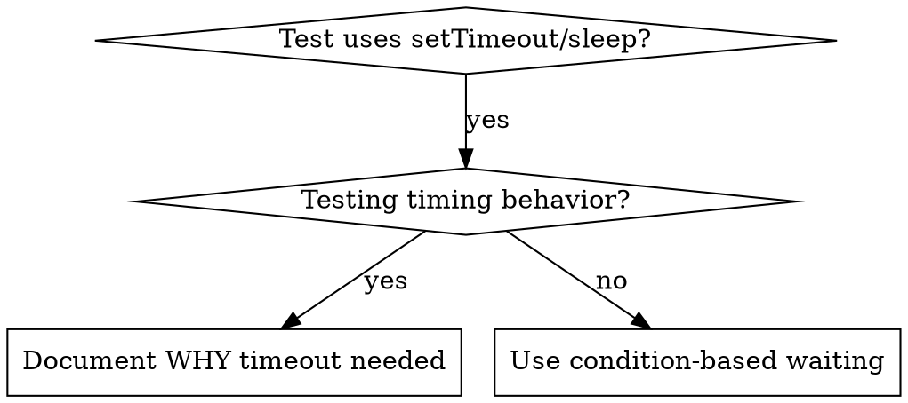

# Condition-Based Waiting

## Overview

不安定な test は、適当な待ち時間で timing を当てにいくことが多い。これが競合状態を生み、速い機械では通るのに、負荷が掛かると、あるいは CI では落ちる。

核となる原則: どれくらい掛かるかの当て推量ではなく、本当に知りたい条件そのものを待て。

## When to Use



使うとき:
- test に適当な待ちがある (`setTimeout`, `sleep`, `time.sleep()`)
- test が不安定 (通ることもあり、負荷が掛かると落ちる)
- 並列に実行すると test が timeout する
- 非同期の操作の完了を待っている

使わないとき:
- timing の振る舞いそのものを test している (debounce、throttle の間隔)
- 適当な timeout を使うなら、必ず理由を書け

## Core Pattern

```typescript
// ❌ BEFORE: Guessing at timing
await new Promise(r => setTimeout(r, 50));
const result = getResult();
expect(result).toBeDefined();

// ✅ AFTER: Waiting for condition
await waitFor(() => getResult() !== undefined);
const result = getResult();
expect(result).toBeDefined();
```

## Quick Patterns

| 場面 | 型 |
|----------|---------|
| event を待つ | `waitFor(() => events.find(e => e.type === 'DONE'))` |
| 状態を待つ | `waitFor(() => machine.state === 'ready')` |
| 個数を待つ | `waitFor(() => items.length >= 5)` |
| file を待つ | `waitFor(() => fs.existsSync(path))` |
| 込み入った条件 | `waitFor(() => obj.ready && obj.value > 10)` |

## Implementation

汎用の監視関数:
```typescript
async function waitFor<T>(
  condition: () => T | undefined | null | false,
  description: string,
  timeoutMs = 5000
): Promise<T> {
  const startTime = Date.now();

  while (true) {
    const result = condition();
    if (result) return result;

    if (Date.now() - startTime > timeoutMs) {
      throw new Error(`Timeout waiting for ${description} after ${timeoutMs}ms`);
    }

    await new Promise(r => setTimeout(r, 10)); // Poll every 10ms
  }
}
```

実際の debug の session から生まれた領域固有の補助 (`waitForEvent`, `waitForEventCount`, `waitForEventMatch`) を含む完全な実装は、この directory の `condition-based-waiting-example.ts` を見よ。

## Common Mistakes

❌ 監視が速すぎる: `setTimeout(check, 1)` — CPU を浪費する
✅ 直し方: 10ms ごとに監視する

❌ timeout が無い: 条件が満たされないと永遠に回る
✅ 直し方: 常に timeout を入れ、明確な error を出す

❌ 古い data: loop の前に状態を控えている
✅ 直し方: loop の中で getter を呼び、新しい値を取る

## When Arbitrary Timeout IS Correct

```typescript
// Tool ticks every 100ms - need 2 ticks to verify partial output
await waitForEvent(manager, 'TOOL_STARTED'); // First: wait for condition
await new Promise(r => setTimeout(r, 200));   // Then: wait for timed behavior
// 200ms = 2 ticks at 100ms intervals - documented and justified
```

条件:
1. まず引き金となる条件を待つ
2. 既知の timing に基づく (当て推量ではない)
3. 理由を comment に書く

## Real-World Impact

ある debug の session から (2025-10-03):
- 3 つの file にまたがる 15 件の不安定な test を直した
- 成功率: 60% → 100%
- 実行時間: 40% 短縮
- 競合状態が無くなった
