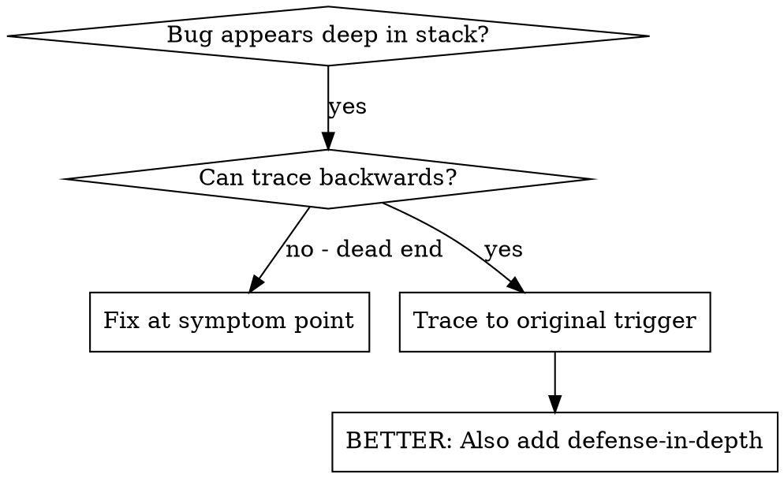
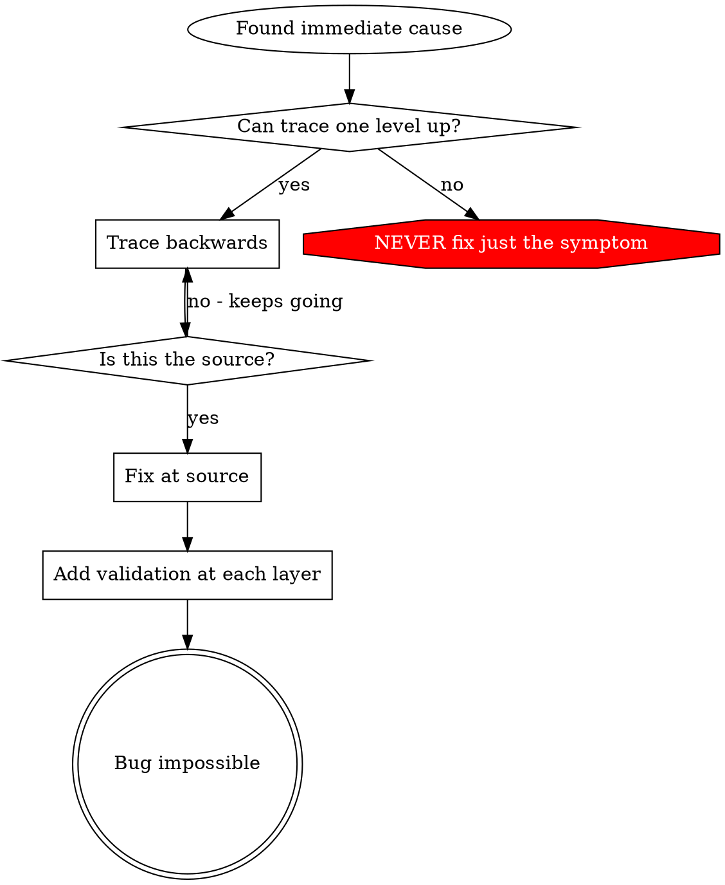

# Root Cause Tracing

## Overview

bug は call stack の深いところに現れることが多い。誤った directory での git init、誤った場所に作られた file、誤った path で開かれた database などだ。error が出た場所で直したくなるが、それは症状への対処だ。

核となる原則: 呼び出しの連鎖を遡り、最初の引き金を見つけよ。そして源で直せ。

## When to Use



使うとき:
- error が実行の深いところで起きる (入口ではない)
- stack trace が長い呼び出しの連鎖を示す
- 不正な data がどこで生まれたか分からない
- どの test や code が問題を引き起こすか突き止めたい

## The Tracing Process

### 1. 症状を観察する
```
Error: git init failed in ~/project/packages/core
```

### 2. 直接の原因を見つける
どの code が直接これを起こすか。
```typescript
await execFileAsync('git', ['init'], { cwd: projectDir });
```

### 3. 問え。これを呼んだのは何か
```typescript
WorktreeManager.createSessionWorktree(projectDir, sessionId)
  → called by Session.initializeWorkspace()
  → called by Session.create()
  → called by test at Project.create()
```

### 4. 遡り続ける
どんな値が渡されたか。
- `projectDir = ''` (空文字列)
- `cwd` が空文字列だと `process.cwd()` に解決される
- それは source code の directory だ

### 5. 最初の引き金を見つける
空文字列はどこから来たか。
```typescript
const context = setupCoreTest(); // Returns { tempDir: '' }
Project.create('name', context.tempDir); // Accessed before beforeEach!
```

## Adding Stack Traces

手で辿れないときは、計測を足せ。

```typescript
// Before the problematic operation
async function gitInit(directory: string) {
  const stack = new Error().stack;
  console.error('DEBUG git init:', {
    directory,
    cwd: process.cwd(),
    nodeEnv: process.env.NODE_ENV,
    stack,
  });

  await execFileAsync('git', ['init'], { cwd: directory });
}
```

重要: test では `console.error()` を使え (logger は出ないことがある)。

実行して取り出す:
```bash
npm test 2>&1 | grep 'DEBUG git init'
```

stack trace を読む:
- test file の名前を探せ
- 呼び出しを起こした行番号を見つけよ
- 型を掴め (同じ test か。同じ引数か)

## Finding Which Test Causes Pollution

test 中に何かが現れるが、どの test か分からないとき:

この directory の二分探索の script `find-polluter.sh` を使え。

```bash
./find-polluter.sh '.git' 'src/**/*.test.ts'
```

test を一つずつ実行し、最初に汚したものを見つけて止まる。使い方は script を見よ。

## Real Example: Empty projectDir

症状: `.git` が `packages/core/` (source code) に作られる

辿った連鎖:
1. `git init` が `process.cwd()` で走る ← cwd が空
2. WorktreeManager が空の projectDir で呼ばれた
3. Session.create() が空文字列を渡した
4. test が beforeEach より前に `context.tempDir` に触れた
5. setupCoreTest() は初期状態で `{ tempDir: '' }` を返す

根本原因: 最上位の変数の初期化が、空の値に触れていた

修正: tempDir を getter にし、beforeEach より前に触れたら例外を投げるようにした

多層の防御も足した:
- Layer 1: Project.create() が directory を検証する
- Layer 2: WorkspaceManager が空でないことを検証する
- Layer 3: NODE_ENV の番人が tmpdir の外での git init を拒む
- Layer 4: git init の前に stack trace を log する

## Key Principle



error が現れた場所だけを直すな。遡って最初の引き金を見つけよ。

## Stack Trace Tips

test の中では: logger ではなく `console.error()` を使え。logger は抑制されることがある
操作の前に: 危険な操作の前に log せよ。失敗した後ではない
文脈を含めよ: directory、cwd、環境変数、時刻
stack を取れ: `new Error().stack` が呼び出しの連鎖を全て示す

## Real-World Impact

ある debug の session から (2025-10-03):
- 5 段階の追跡で根本原因を見つけた
- 源で直した (getter の検証)
- 4 層の防御を足した
- 1847 件の test が通り、汚染は無くなった
