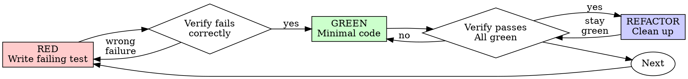

# Test-Driven Development (TDD)

## Overview

先に test を書け。落ちるのを見よ。通すための最小限の code を書け。

核となる原則: test が落ちるのを見ていないなら、それが正しいものを test しているか分からない。

規則の字面を破ることは、規則の精神を破ることだ。

## When to Use

常に:
- 新しい機能
- bug の修正
- refactoring
- 振る舞いの変更

例外 (人間の相棒に尋ねよ):
- 使い捨ての試作
- 生成された code
- 設定 file

「今回だけ TDD を飛ばそう」と考えているか。止まれ。それは言い訳だ。

## The Iron Law

```
NO PRODUCTION CODE WITHOUT A FAILING TEST FIRST
```

test より先に code を書いたか。消せ。やり直せ。

例外は無い:
- 「参考」として残すな
- test を書きながら「流用」するな
- 見るな
- 消すとは消すことだ

test から新たに実装せよ。以上。

## Red-Green-Refactor



### RED - Write Failing Test

何が起きるべきかを示す、最小の test を一つ書け。

<Good>
```typescript
test('retries failed operations 3 times', async () => {
  let attempts = 0;
  const operation = () => {
    attempts++;
    if (attempts < 3) throw new Error('fail');
    return 'success';
  };

  const result = await retryOperation(operation);

  expect(result).toBe('success');
  expect(attempts).toBe(3);
});
```
名前が明確。実際の振る舞いを test している。一つのことだけ
</Good>

<Bad>
```typescript
test('retry works', async () => {
  const mock = jest.fn()
    .mockRejectedValueOnce(new Error())
    .mockRejectedValueOnce(new Error())
    .mockResolvedValueOnce('success');
  await retryOperation(mock);
  expect(mock).toHaveBeenCalledTimes(3);
});
```
名前が曖昧。code ではなく mock を test している
</Bad>

条件:
- 振る舞いは一つ
- 名前が明確
- 実際の code を使う (避けられない場合を除き mock 無し)

### Verify RED - Watch It Fail

必須。決して飛ばすな。

```bash
npm test path/to/test.test.ts
```

確かめること:
- test が失敗する (error ではなく)
- 失敗の message が想定通り
- 機能が無いから落ちている (誤字のせいではない)

test が通ったら: 既存の振る舞いを test している。test を直せ。

test が error になったら: error を直し、正しく落ちるまで実行し直せ。

### GREEN - Minimal Code

test を通す、最も単純な code を書け。

<Good>
```typescript
async function retryOperation<T>(fn: () => Promise<T>): Promise<T> {
  for (let i = 0; i < 3; i++) {
    try {
      return await fn();
    } catch (e) {
      if (i === 2) throw e;
    }
  }
  throw new Error('unreachable');
}
```
通すのに必要な分だけ
</Good>

<Bad>
```typescript
async function retryOperation<T>(
  fn: () => Promise<T>,
  options?: {
    maxRetries?: number;
    backoff?: 'linear' | 'exponential';
    onRetry?: (attempt: number) => void;
  }
): Promise<T> {
  // YAGNI
}
```
作り込みすぎ
</Bad>

機能を足すな。他の code を refactoring するな。test を超えて「良く」するな。

### Verify GREEN - Watch It Pass

必須。

```bash
npm test path/to/test.test.ts
```

確かめること:
- test が通る
- 他の test も通ったまま
- 出力が綺麗 (error も警告も無い)

test が落ちたら: test ではなく code を直せ。

他の test が落ちたら: 今すぐ直せ。

### REFACTOR - Clean Up

緑になった後だけ:
- 重複を消す
- 名前を良くする
- 補助を切り出す

test は緑のまま保て。振る舞いを足すな。

### Repeat

次の機能のために、次の落ちる test を書け。

## Good Tests

| 性質 | 良い | 悪い |
|---------|------|-----|
| 最小 | 一つのことだけ。名前に「and」があるなら分けよ | `test('validates email and domain and whitespace')` |
| 明確 | 名前が振る舞いを述べている | `test('test1')` |
| 意図を示す | 望ましい API を示している | code が何をすべきか分からない |

test を書くとき、変えるときは、[writing-good-tests.md](writing-good-tests.md) を読め。test を誠実に保つ規則がある。
- その test を落とす production 側の変更を名指しせよ。書く前にだ
- mock の振る舞いではなく、実際の振る舞いを assert せよ
- test だけが使う code は test の道具に置け。production の class に置くな
- mock する前に、その依存の副作用を理解せよ

## Common Rationalizations

| 言い訳 | 実際 |
|--------|---------|
| 「単純すぎて test は要らない」 | 単純な code も壊れる。test は 30 秒で書ける。 |
| 「後で test を書く」 | 後から書いた test は最初から通る。それは何も証明しない。誤ったものを test するかもしれない。振る舞いではなく実装を test するかもしれない。忘れていた境界の場合を見落とすかもしれない。落ちるのを見ていないのだから、bug を捕まえられる証明が無い。test を先に書けば、その失敗が強制される。 |
| 「後から書いても目的は同じだ (形式より精神)」 | 後から書く test は「これは何をするか」に答える。先に書く test は「これは何をすべきか」に答える。後から書く test は、既に書いた code に引きずられる。覚えていた場合は確かめるが、発見できたはずの場合は確かめない。test が働く証明の無い網羅率だ。 |
| 「もう手で試した」 | 手作業の test は場当たりだ。何を確かめたかの記録が無く、code が変わっても再実行できず、切迫すると場合を忘れやすい。「試したときは動いた」は網羅ではない。自動 test は毎回同じように走る。 |
| 「X 時間を捨てるのはもったいない」 | 埋没費用の誤りだ。その時間はどちらにせよ既に使われた。実際の選択は、TDD で書き直す (高い確信) か、残して後から test を継ぎ足す (低い確信、たぶん bug 混じり) かだ。信じられない code を残すことこそ無駄だ。 |
| 「参考に残して、test は先に書く」 | 流用してしまう。それは後から書く test だ。消すとは消すことだ。 |
| 「まず探る必要がある」 | 構わない。探ったものは捨て、TDD で始めよ。 |
| 「test しにくい = 設計が不明瞭」 | test の声を聞け。test しにくいものは使いにくい。 |
| 「TDD は遅くなる」 | TDD こそ実際的な道だ。commit 前に bug を捕まえ、回帰を防ぎ、恐れずに refactoring できる。「実際的」な近道は、production での debug を招く。速くはならない。 |
| 「手で試す方が速い」 | 手作業は境界の場合を証明しない。変更のたびに試し直すことになる。 |
| 「既存の code に test が無い」 | あなたはそれを良くしている。既存の code にも test を足せ。 |

## Red Flags - STOP and Start Over

- test より先に code
- 実装の後に test
- test が最初から通る
- なぜ test が落ちたか説明できない
- test を「後で」足す
- 「今回だけ」と言い訳する
- 「もう手で試した」
- 「後から書いても目的は同じだ」
- 「形式ではなく精神の問題だ」
- 「参考に残す」「既存の code を流用する」
- 「もう X 時間使った。消すのはもったいない」
- 「TDD は教条的だ。私は実際的でいる」
- 「これは事情が違って…」

これらは全て同じ意味だ: code を消せ。TDD でやり直せ。

## Example: Bug Fix

bug: 空の email が受け付けられる

RED
```typescript
test('rejects empty email', async () => {
  const result = await submitForm({ email: '' });
  expect(result.error).toBe('Email required');
});
```

Verify RED
```bash
$ npm test
FAIL: expected 'Email required', got undefined
```

GREEN
```typescript
function submitForm(data: FormData) {
  if (!data.email?.trim()) {
    return { error: 'Email required' };
  }
  // ...
}
```

Verify GREEN
```bash
$ npm test
PASS
```

REFACTOR
必要なら、複数の項目に使える検証を切り出せ。

## Verification Checklist

作業を完了とする前に:

- [ ] 新しい関数や method には全て test がある
- [ ] 実装の前に、test が落ちるのを見た
- [ ] 各 test は想定した理由で落ちた (誤字ではなく機能の欠如)
- [ ] 各 test を通す最小限の code を書いた
- [ ] 全ての test が通る
- [ ] 出力が綺麗 (error も警告も無い)
- [ ] test は実際の code を使う (避けられない場合だけ mock)
- [ ] 境界の場合と error を覆っている

全てに印を付けられないか。TDD を飛ばしている。やり直せ。

## When Stuck

| 問題 | 解 |
|---------|----------|
| test の書き方が分からない | 望む API を書け。先に assert を書け。人間の相棒に尋ねよ。 |
| test が込み入りすぎる | 設計が込み入りすぎている。interface を単純にせよ。 |
| 何もかも mock が要る | code の結合が強すぎる。依存を注入せよ。 |
| test の準備が巨大 | 補助を切り出せ。まだ複雑なら設計を単純にせよ。 |

## Debugging Integration

bug を見つけたか。それを再現する、落ちる test を書け。TDD の周期に従え。test が修正を証明し、回帰を防ぐ。

test なしに bug を直すな。

## Final Rule

```
production の code → test が存在し、先に落ちた
そうでないなら → TDD ではない
```

人間の相棒の許しなく、例外を作るな。
