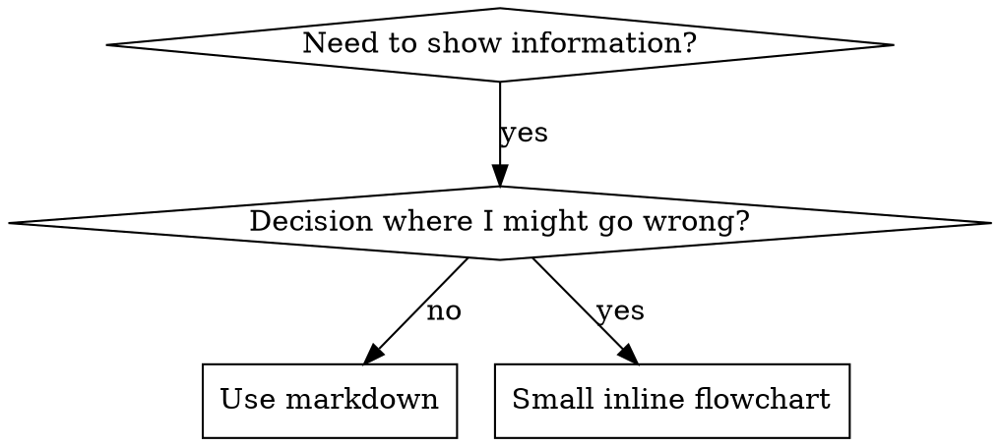

# Writing Skills

## Overview

skill を書くことは、手順の文書に適用した Test-Driven Development だ。

個人の skill は、その runtime の skills directory に置く (Claude Code なら `~/.claude/skills/`)。他の runtime での path は [codex-tools.md](../using-superpowers/references/codex-tools.md) か [gemini-tools.md](../using-superpowers/references/gemini-tools.md) を見よ。Codex、Copilot CLI、Gemini CLI はいずれも `~/.agents/skills/` を runtime 横断の別名として認識する。

あなたは test の場合を書く (subagent を使う圧力の場面)。それが落ちるのを見る (基準の振る舞い)。skill を書く (文書)。test が通るのを見る (agent が従う)。そして refactor する (抜け道を塞ぐ)。

核となる原則: skill 無しで agent が失敗するのを見ていないなら、その skill が正しいことを教えているか分からない。

必須の前提: この skill を使う前に superpowers:test-driven-development を理解していること。あの skill が RED-GREEN-REFACTOR の基本の周期を定める。この skill は TDD を文書に当てはめたものだ。

公式の手引き: Anthropic 公式の skill 執筆の定石は anthropic-best-practices.md を見よ。この文書は、ここでの TDD 中心の進め方を補う型と指針を示す。

## What is a Skill?

skill とは、実証された手法、型、道具の参照用の手引きだ。skill は、後の agent が有効な進め方を見つけ、適用する助けになる。

skill であるもの: 再利用できる手法、型、道具、参照用の手引き

skill でないもの: 一度どう解いたかという物語

## TDD Mapping for Skills

| TDD の概念 | skill の作成 |
|-------------|----------------|
| test の場合 | subagent を使う圧力の場面 |
| production の code | skill の文書 (SKILL.md) |
| test が落ちる (RED) | skill 無しで agent が規則を破る (基準) |
| test が通る (GREEN) | skill があると agent が従う |
| refactor | 従わせたまま抜け道を塞ぐ |
| 先に test を書く | skill を書く前に基準の場面を実行する |
| 落ちるのを見る | agent が使う言い訳をそのまま記録する |
| 最小の code | その違反に的を絞った skill を書く |
| 通るのを見る | agent が従うようになったことを確かめる |
| refactor の周期 | 新しい言い訳を見つける → 塞ぐ → 確かめ直す |

skill の作成の全体が RED-GREEN-REFACTOR に従う。

## When to Create a Skill

作るとき:
- その手法が、あなたにとって直感的に明らかではなかった
- project をまたいで、また参照することになる
- 型が広く当てはまる (project 固有ではない)
- 他の人の役にも立つ

作らないとき:
- 一度きりの解
- 他所によく書かれている標準的な作法
- project 固有の取り決め (指示 file に書け)
- 機械的な制約 (regex や検証で強制できるなら自動化せよ。文書は判断が要ることに使え)

## Skill Types

### Technique
辿るべき step のある具体的な方法 (condition-based-waiting, root-cause-tracing)

### Pattern
問題の捉え方 (flatten-with-flags, test-invariants)

### Reference
API の文書、構文の手引き、道具の説明 (office docs)

## Directory Structure

```
skills/
  skill-name/
    SKILL.md              # Main reference (required)
    supporting-file.*     # Only if needed
```

平坦な名前空間 — 全ての skill が、検索できる一つの名前空間にある

別 file にするもの:
1. 重い参照 (100 行以上) — API の文書、網羅的な構文
2. 再利用できる道具 — script、utility、template

本文に置くもの:
- 原則と概念
- code の型 (50 行未満)
- それ以外の全て

## SKILL.md Structure

frontmatter (YAML):
- 必須の field は二つ: `name` と `description` (対応する field の全体は [agentskills.io/specification](https://agentskills.io/specification) を見よ)
- 全体で最大 1024 文字
- `name`: 英数字と hyphen だけを使う (括弧や特殊文字は使わない)
- `description`: 三人称で、いつ使うかだけを述べる (何をするかではない)
  - 「Use when…」で始め、起動の条件に集中せよ
  - 具体的な症状、状況、文脈を含めよ
  - skill の過程や workflow を要約するな (理由は SDO の節を見よ)
  - できれば 500 文字未満に収めよ

```markdown
---
name: Skill-Name-With-Hyphens
description: Use when [specific triggering conditions and symptoms]
---

# Skill Name

## Overview
What is this? Core principle in 1-2 sentences.

## When to Use
[Small inline flowchart IF decision non-obvious]

Bullet list with SYMPTOMS and use cases
When NOT to use

## Core Pattern (for techniques/patterns)
Before/after code comparison

## Quick Reference
Table or bullets for scanning common operations

## Implementation
Inline code for simple patterns
Link to file for heavy reference or reusable tools

## Common Mistakes
What goes wrong + fixes

## Real-World Impact (optional)
Concrete results
```

## Skill Discovery Optimization (SDO)

発見のために重要: 後の agent があなたの skill を見つけられなければならない

### 1. 充実した description field

目的: agent は description を読んで、その task にどの skill を読み込むか決める。「今これを読むべきか」に答えられる内容にせよ。

形式: 「Use when…」で始め、起動の条件に集中せよ。

重要: description は「いつ使うか」であって、「skill が何をするか」ではない

description は起動の条件だけを述べること。skill の過程や workflow を description で要約するな。

なぜ重要か: test で分かったことがある。description が skill の workflow を要約していると、agent は skill の中身を読まず、description の方に従うことがある。ある skill の flowchart は二段階の review を明示していた。それでも「task の合間に code review」と書いた description のせいで、agent は review を一度しか行わなかった。

description を `Use when executing implementation plans with independent tasks` だけに変えた (workflow の要約なし)。すると agent は flowchart を正しく読み、二段階の review に従った。

罠: workflow を要約する description は、agent が通る近道を作る。skill の本体は、読み飛ばされる文書になる。

```yaml
# ❌ BAD: Summarizes workflow - agents may follow this instead of reading skill
description: Use when executing plans - dispatches subagent per task with code review between tasks

# ❌ BAD: Too much process detail
description: Use for TDD - write test first, watch it fail, write minimal code, refactor

# ✅ GOOD: Just triggering conditions, no workflow summary
description: Use when executing implementation plans with independent tasks in the current session

# ✅ GOOD: Triggering conditions only
description: Use when implementing any feature or bugfix, before writing implementation code
```

中身:
- この skill が当てはまることを示す、具体的な引き金、症状、状況を使え
- 言語固有の症状 (setTimeout, sleep) ではなく、問題そのもの (競合状態、一貫しない振る舞い) を述べよ
- skill 自体が特定の技術に固有でない限り、引き金も技術に依存させるな
- skill が特定の技術に固有なら、引き金でそれを明示せよ
- 三人称で書け (system prompt に差し込まれる)
- skill の過程や workflow を要約するな

```yaml
# ❌ BAD: Too abstract, vague, doesn't include when to use
description: For async testing

# ❌ BAD: First person
description: I can help you with async tests when they're flaky

# ❌ BAD: Mentions technology but skill isn't specific to it
description: Use when tests use setTimeout/sleep and are flaky

# ✅ GOOD: Starts with "Use when", describes problem, no workflow
description: Use when tests have race conditions, timing dependencies, or pass/fail inconsistently

# ✅ GOOD: Technology-specific skill with explicit trigger
description: Use when using React Router and handling authentication redirects
```

### 2. 検索語の網羅

agent が探しそうな言葉を使え。
- error message: 「Hook timed out」「ENOTEMPTY」「race condition」
- 症状: 「flaky」「hanging」「zombie」「pollution」
- 類語: 「timeout/hang/freeze」「cleanup/teardown/afterEach」
- 道具: 実際の command、library 名、file の種類

### 3. 説明的な命名

能動態で、動詞から始めよ。
- ✅ `creating-skills` であって `skill-creation` ではない
- ✅ `condition-based-waiting` であって `async-test-helpers` ではない

### 4. token の節約 (重要)

問題: getting-started や、よく参照される skill は、全ての会話に読み込まれる。token の一つ一つが効く。

目安の語数:
- getting-started の workflow: それぞれ 150 語未満
- よく読み込まれる skill: 全体で 200 語未満
- その他の skill: 500 語未満 (それでも簡潔に)

手立て:

詳細は tool の help へ移せ:
```bash
# ❌ BAD: Document all flags in SKILL.md
search-conversations supports --text, --both, --after DATE, --before DATE, --limit N

# ✅ GOOD: Reference --help
search-conversations supports multiple modes and filters. Run --help for details.
```

相互参照を使え:
```markdown
# ❌ BAD: Repeat workflow details
When searching, dispatch subagent with template...
[20 lines of repeated instructions]

# ✅ GOOD: Reference other skill
Always use subagents (50-100x context savings). REQUIRED: Use [other-skill-name] for workflow.
```

例を圧縮せよ:
```markdown
# ❌ BAD: Verbose example (42 words)
your human partner: "How did we handle authentication errors in React Router before?"
You: I'll search past conversations for React Router authentication patterns.
[Dispatch subagent with search query: "React Router authentication error handling 401"]

# ✅ GOOD: Minimal example (20 words)
Partner: "How did we handle auth errors in React Router?"
You: Searching...
[Dispatch subagent → synthesis]
```

重複を無くせ:
- 相互参照した skill にあることを繰り返すな
- command から明らかなことを説明するな
- 同じ型の例を複数入れるな

確認:
```bash
wc -w skills/path/SKILL.md
# getting-started workflows: aim for <150 each
# Other frequently-loaded: aim for <200 total
```

何をするか、または核となる洞察で名付けよ:
- ✅ `condition-based-waiting` > `async-test-helpers`
- ✅ `using-skills` であって `skill-usage` ではない
- ✅ `flatten-with-flags` > `data-structure-refactoring`
- ✅ `root-cause-tracing` > `debugging-techniques`

過程には動名詞 (-ing) がよく合う:
- `creating-skills`, `testing-skills`, `debugging-with-logs`
- 能動的で、取っている行動を述べている

### 5. 他の skill への相互参照

他の skill を参照する文書を書くとき:

skill 名だけを使い、必須かどうかの印を明示せよ。
- ✅ 良い: `**REQUIRED SUB-SKILL:** Use superpowers:test-driven-development`
- ✅ 良い: `**REQUIRED BACKGROUND:** You MUST understand superpowers:systematic-debugging`
- ❌ 悪い: `See skills/testing/test-driven-development` (必須か分からない)
- ❌ 悪い: `@skills/testing/test-driven-development/SKILL.md` (強制的に読み込み、context を焼く)

@ の link を使わない理由: `@` の構文は file を即座に強制的に読み込み、必要になる前に 200k 以上の context を食う。

## Flowchart Usage



flowchart を使うのは次の場合だけだ:
- 自明でない判断の分岐
- 早く止めてしまいがちな過程の loop
- 「A と B のどちらを使うか」の判断

flowchart を決して使わない場合:
- 参照の資料 → 表、箇条書き
- code の例 → markdown の block
- 一直線の指示 → 番号付きの箇条書き
- 意味を持たない label (step1, helper2)

graphviz の書き方の規則は、この directory の `graphviz-conventions.dot` を見よ。

人間の相棒に見せるとき: この directory の `render-graphs.js` を使い、skill の flowchart を SVG に描け。
```bash
./render-graphs.js ../some-skill           # Each diagram separately
./render-graphs.js ../some-skill --combine # All diagrams in one SVG
```

## Code Examples

優れた例が一つあれば、凡庸な例を並べるより良い

最も関わりの深い言語を選べ。
- test の手法 → TypeScript/JavaScript
- 系の debug → Shell/Python
- data の処理 → Python

良い例:
- 完結していて、実行できる
- なぜそうするかを説明する comment がある
- 実際の場面から取られている
- 型がはっきり見える
- そのまま応用できる (汎用の雛形ではない)

してはいけないこと:
- 5 つ以上の言語で実装する
- 穴埋め式の雛形を作る
- 作り物の例を書く

あなたは移植が得意だ。優れた例が一つあれば足りる。

## File Organization

### 自己完結した skill
```
defense-in-depth/
  SKILL.md    # Everything inline
```
使う場面: 中身が全て収まり、重い参照が要らないとき

### 再利用できる道具を持つ skill
```
condition-based-waiting/
  SKILL.md    # Overview + patterns
  example.ts  # Working helpers to adapt
```
使う場面: 道具が、語りではなく再利用できる code のとき

### 重い参照を持つ skill
```
pptx/
  SKILL.md       # Overview + workflows
  pptxgenjs.md   # 600 lines API reference
  ooxml.md       # 500 lines XML structure
  scripts/       # Executable tools
```
使う場面: 参照の資料が、本文に収めるには大きすぎるとき

## The Iron Law (Same as TDD)

```
NO SKILL WITHOUT A FAILING TEST FIRST
```

新しい skill にも、既存の skill の編集にも当てはまる。

test の前に skill を書いたか。消せ。やり直せ。
test せずに skill を編集したか。同じ違反だ。

例外は無い:
- 「単純な追加」でも駄目
- 「節を一つ足すだけ」でも駄目
- 「文書の更新」でも駄目
- test していない変更を「参考」として残すな
- test を回しながら「流用」するな
- 消すとは消すことだ

必須の前提: superpowers:test-driven-development skill が、なぜこれが重要かを説明する。同じ原則が文書にも当てはまる。

## Testing All Skill Types

skill の種別ごとに、test の進め方が違う。

### 規律を課す skill (規則や要件)

例: TDD、verification-before-completion、designing-before-coding

test の仕方:
- 学術的な質問: 規則を理解しているか
- 圧力の場面: 負荷の下でも従うか
- 複数の圧力の組み合わせ: 時間 + 埋没費用 + 疲労
- 言い訳を特定し、明示的な反論を足す

成功の基準: 最大の圧力の下でも agent が規則に従う

### 手法の skill (やり方の手引き)

例: condition-based-waiting、root-cause-tracing、defensive-programming

test の仕方:
- 適用の場面: その手法を正しく適用できるか
- 変化の場面: 境界の場合を扱えるか
- 情報の欠落の test: 指示に穴が無いか

成功の基準: agent が新しい場面にその手法をうまく適用する

### 型の skill (思考の枠組み)

例: reducing-complexity、information-hiding の概念

test の仕方:
- 認識の場面: 型が当てはまる場面だと気付くか
- 適用の場面: その枠組みを使えるか
- 反例: 当てはめてはいけない場合が分かるか

成功の基準: agent が、いつどう型を当てはめるか正しく判断する

### 参照の skill (文書や API)

例: API の文書、command の一覧、library の手引き

test の仕方:
- 取り出しの場面: 正しい情報を見つけられるか
- 適用の場面: 見つけたものを正しく使えるか
- 穴の test: よくある使い方が覆われているか

成功の基準: agent が参照の情報を見つけ、正しく適用する

## Common Rationalizations for Skipping Testing

| 言い訳 | 実際 |
|--------|---------|
| 「この skill は明らかに分かりやすい」 | あなたにとって明らかでも、他の agent には違う。test せよ。 |
| 「ただの参照だ」 | 参照にも穴や不明瞭な節がある。取り出しを test せよ。 |
| 「test は大げさだ」 | test していない skill には必ず問題がある。15 分の test が数時間を救う。 |
| 「問題が出たら test する」 | 問題 = agent がその skill を使えない。配る前に test せよ。 |
| 「test は面倒すぎる」 | 悪い skill を production で debug するより面倒ではない。 |
| 「良い出来だと確信している」 | 過信は必ず問題を生む。それでも test せよ。 |
| 「読んで確かめれば十分だ」 | 読むことと使うことは違う。適用の場面を test せよ。 |
| 「test する時間が無い」 | test していない skill を配れば、後で直す時間の方が掛かる。 |

これらは全て同じ意味だ: 配る前に test せよ。例外は無い。

## Match the Form to the Failure

手引きを書く前に、基準の失敗を分類せよ。ある失敗の型を固める形は、別の型では測定できるほど逆効果になる。

| 基準の失敗 | 正しい形 | 誤った形 |
|---|---|---|
| 圧力の下で規則を飛ばす/破る (分かっていて、それでもやる) | 禁止 + 言い訳の表 + red flags (下の Bulletproofing を見よ) | 柔らかい助言 (「〜が望ましい」「〜を検討せよ」) |
| 従うが、出力の形が誤っている (膨らんだ prompt、埋もれた結論、仕様の再掲) | 肯定形の手順か契約: 出力が何であるかを、要素と順序で述べる | 禁止の一覧 (「再掲するな」「語るな」) |
| 既に作っているものから、必要な要素が抜ける | 構造で解く: 埋める template に必須の field や枠を置く | template の近くに散文で注意を書く |
| 条件によって振る舞いを変えたい | 観測できる述語に紐付けた条件文 (「brief があるなら、それを参照せよ」) | 無条件の規則 + 例外の但し書き |

形を整える問題で禁止が逆効果になる理由: 競合する動機 (「prompt を自己完結させよ」) の下では、agent は「X するな」と交渉する。起動 prompt の手引きについて文言を一対一で比べた test では、禁止の側が手順の側より明らかに多く不要な内容を生み (分布が完全に分かれた)、手引き無しの対照群より悪い傾向すら示した。決め付けずに自分の場合を micro-test せよ。しかし既定で禁止に手を伸ばすな。手順には交渉の余地が無い。出力が示された形に合うか、合わないかだ。

どの形を選んでも守る規則:
- 但し書きを付けるな。「重要でなければ X するな」は交渉を再開させる。同じ文言の test では、勝っていた手順に但し書きを一つ足しただけで、一貫していた結果が揺らいだ。本当の例外は、観測できる述語に紐付けた独立した条件文として書け
- 例外の但し書きは範囲を限れない。「この制限は code block には当てはまらない」と書いても、code block は抑制される。出力の一部を除外する必要があるなら、規則がそこに届かないよう組み直せ

## Bulletproofing Skills Against Rationalization

規律を課す skill (TDD など) は、言い訳に耐える必要がある。agent は賢く、圧力の下では抜け道を見つける。

適用の範囲: この道具立ては規律の失敗のためのものだ。規則を知っていて、圧力の下で飛ばす agent が相手だ。形の誤った出力や要素の欠落には、禁止による補強は逆効果になる。「Match the Form to the Failure」の形を使え。

心理の注記: 説得の手法がなぜ効くかを理解すると、体系的に使える。効くのは権威、一貫性、希少性、社会的証明、一体感の原則だ。研究の基礎は persuasion-principles.md を見よ (Cialdini, 2021; Meincke et al., 2025)。

### 抜け道を一つずつ明示的に塞ぐ

規則を述べるだけでなく、具体的な回避策を禁じよ。

<Bad>
```markdown
Write code before test? Delete it.
```
</Bad>

<Good>
```markdown
Write code before test? Delete it. Start over.

**No exceptions:**
- Don't keep it as "reference"
- Don't "adapt" it while writing tests
- Don't look at it
- Delete means delete
```
</Good>

### 「精神か字面か」の議論に先回りする

基礎となる原則を早い位置に置け。

```markdown
**Violating the letter of the rules is violating the spirit of the rules.**
```

これで「精神には従っている」という言い訳の一群が丸ごと断てる。

### 言い訳の表を作る

基準の test で出た言い訳を集めよ (下の Testing の節を見よ)。agent が言った言い訳は全て表に入れる。

```markdown
| Excuse | Reality |
|--------|---------|
| "Too simple to test" | Simple code breaks. Test takes 30 seconds. |
| "I'll test after" | Tests passing immediately prove nothing. |
| "Tests after achieve same goals" | Tests-after = "what does this do?" Tests-first = "what should this do?" |
```

### red flags の一覧を作る

言い訳しているとき、agent が自分で気付けるようにせよ。

```markdown
## Red Flags - STOP and Start Over

- Code before test
- "I already manually tested it"
- "Tests after achieve the same purpose"
- "It's about spirit not ritual"
- "This is different because..."

**All of these mean: Delete code. Start over with TDD.**
```

### 違反の症状で SDO を更新する

description に、規則を破る直前の症状を足せ。

```yaml
description: use when implementing any feature or bugfix, before writing implementation code
```

## RED-GREEN-REFACTOR for Skills

TDD の周期に従え。

### RED: 落ちる test を書く (基準)

skill 無しで、subagent に圧力の場面を実行させよ。振る舞いをそのまま記録せよ。
- どんな選択をしたか
- どんな言い訳を使ったか (逐語で)
- どの圧力が違反の引き金になったか

これが「test が落ちるのを見る」だ。skill を書く前に、agent が自然にどう振る舞うかを見なければならない。

### GREEN: 最小の skill を書く

その具体的な言い訳に的を絞った skill を書け。仮定の場合のために内容を足すな。

同じ場面を skill ありで実行せよ。agent は従うようになるはずだ。

### REFACTOR: 抜け道を塞ぐ

agent が新しい言い訳を見つけたか。明示的な反論を足せ。破られなくなるまで test し直せ。

### 場面の全体を回す前に、文言を micro-test せよ

圧力の場面の全体は最後の関門だが、一回ごとに遅く高い。まず文言そのものを micro-test で確かめよ。

1. 呼び出しごとに、真新しい context で 1 標本 — 生の API 呼び出し、API が使えないなら一回きりの subagent。system prompt は、その手引きが置かれる現実の文脈にせよ (手引き単体ではなく、skill や prompt template の全体)。user の message は、その失敗を誘う task にせよ
2. 必ず手引き無しの対照群を入れよ。対照群がその失敗を示さないなら、直すものは無い。止めよ。手引きを書くな
3. 変種ごとに 5 回以上。1 標本は嘘をつく
4. 引っ掛かった箇所は全て自分の目で読め。機械的に採点してもよいが、template の反復や引用された反例が命中に化ける。自動の集計だけでは、失敗も成功も過大に見える
5. ばらつきも指標だ。手引きが効いていれば、各回は同じ形に収束する。5 回で 5 通りの解釈が出るなら、その文言は拘束していない。語を足す前に形を締めよ

micro-test は文言を確かめるものだ。規律の skill について、圧力の場面の代わりにはならない。

test の方法論: 完全な方法論は [testing-skills-with-subagents.md](testing-skills-with-subagents.md) を見よ。
- 圧力の場面の書き方
- 圧力の種類 (時間、埋没費用、権威、疲労)
- 穴を体系的に塞ぐ方法
- meta の test の手法

## Anti-Patterns

### ❌ 物語の例
「2025-10-03 の session で、空の projectDir が原因で…」
なぜ悪いか: 具体的すぎて再利用できない

### ❌ 多言語での薄まり
example-js.js, example-py.py, example-go.go
なぜ悪いか: どれも凡庸になり、保守の負担になる

### ❌ flowchart の中の code
```dot
step1 [label="import fs"];
step2 [label="read file"];
```
なぜ悪いか: copy できず、読みにくい

### ❌ 意味の無い label
helper1, helper2, step3, pattern4
なぜ悪いか: label には意味があるべきだ

## STOP: Before Moving to Next Skill

どんな skill でも、書いた後は必ず止まり、配布の手順を終えること。

してはいけないこと:
- それぞれを test せずに、skill をまとめて作る
- 今の skill を確かめる前に、次の skill へ移る
- 「まとめた方が効率的だから」と test を飛ばす

下の配布の checklist は、skill ごとに必須だ。

test していない skill を配ることは、test していない code を配ることだ。品質の基準への違反だ。

## Skill Creation Checklist (TDD Adapted)

重要: 下の checklist の項目ごとに todo を作れ。

RED phase — 落ちる test を書く:
- [ ] 圧力の場面を作る (規律の skill なら圧力を 3 つ以上組み合わせる)
- [ ] skill 無しで場面を実行し、基準の振る舞いを逐語で記録する
- [ ] 言い訳や失敗の型を特定する

GREEN phase — 最小の skill を書く:
- [ ] 名前は英数字と hyphen だけ (括弧や特殊文字を使わない)
- [ ] YAML の frontmatter に必須の `name` と `description` がある (最大 1024 文字。[仕様](https://agentskills.io/specification) を見よ)
- [ ] description が「Use when…」で始まり、具体的な引き金と症状を含む
- [ ] description が三人称で書かれている
- [ ] 検索のための語が全体に散りばめられている (error、症状、道具)
- [ ] 核となる原則を含む明快な overview がある
- [ ] RED で特定した具体的な失敗に的を絞っている
- [ ] 手引きの形が失敗の型に合っている (Match the Form to the Failure を見よ)
- [ ] 振る舞いを整える手引きなら: 手引き無しの対照群と比べ、文言を micro-test した。5 回以上回し、引っ掛かった箇所は全て自分の目で読んだ (純粋な参照の skill では該当しない)
- [ ] code は本文に置くか、別 file に link する
- [ ] 優れた例が一つある (多言語にしない)
- [ ] skill ありで場面を実行し、agent が従うようになったことを確かめた

REFACTOR phase — 抜け道を塞ぐ:
- [ ] test から新しい言い訳を特定する
- [ ] 明示的な反論を足す (規律の skill なら)
- [ ] 全ての test の回から言い訳の表を作る
- [ ] red flags の一覧を作る
- [ ] 破られなくなるまで test し直す

品質の確認:
- [ ] 小さな flowchart は、判断が自明でないときだけ
- [ ] 早見の表がある
- [ ] よくある誤りの節がある
- [ ] 物語を語っていない
- [ ] 補助の file は、道具か重い参照のためだけ

配布:
- [ ] skill を git に commit し、fork に push する (設定しているなら)
- [ ] 広く役立つなら、PR で還元することを考える

## Discovery Workflow

後の agent が、あなたの skill を見つけるまで。

1. 問題に出くわす (「test が不安定だ」)
2. skill を探す (description を grep し、分類を見る)
3. SKILL を見つける (description が一致する)
4. overview をざっと読む (これは関係あるか)
5. 型を読む (早見の表)
6. 例を読み込む (実装するときだけ)

この流れに最適化せよ。検索される語を、早く、何度も置け。
