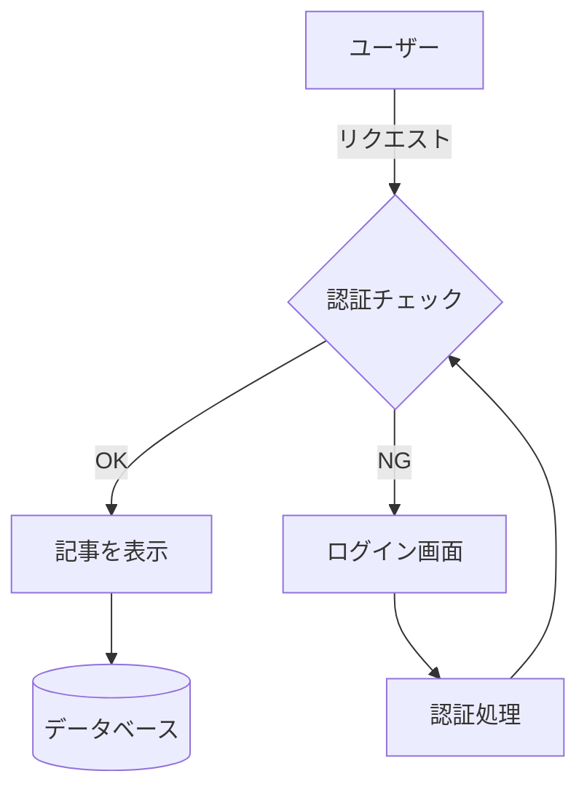
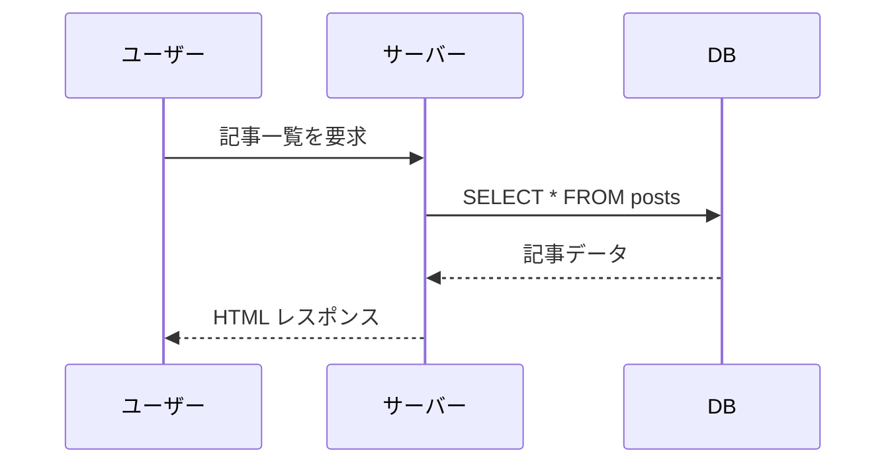

# PlemolJP35 Console NF フォント確認

人類社会のすべての構成員の固有の尊厳と平等で譲ることのできない権利とを承認することは、世界における自由、正義及び平和の基礎である。The quick brown fox jumps over the lazy dog. 0123456789

## 半角・全角の幅比チェック

```
あいうえおかきくけこ  ← 全角10文字
abcdefghijklmnopqrst  ← 半角20文字（35なら 6:10 で揃う）
||||||||||||||||||||
ＡＢＣ１２３ｱｲｳ ｶﾞｷﾞｸﾞ
```

## 紛らわしい文字（プログラミング可読性）

```
Il1| O0 rn m {} [] () <> ;: ,. `'" -=~
0O Il1 B8 5S 2Z 9q g9 vy
```

## 罫線・Box Drawing

```
┌──────────┬──────────┐
│ 項目     │ 値       │
├──────────┼──────────┤
│ フォント │ PlemolJP │
│ サイズ   │ 14px     │
└──────────┴──────────┘
━━━━━━━━━━ │ ─ ┐ ┘ ╭╮╰╯ ┃ ┏┓┗┛
░▒▓█ ▁▂▃▄▅▆▇█ ◢◣◤◥
```

## Nerd Fonts アイコン

```
       
  󰊢      
       
```

## コードブロック（日本語コメント混在）

```typescript
/**
 * ユーザー情報を取得する
 * @param id - ユーザーID
 */
async function getUser(id: number): Promise<User | null> {
  const user = await db.users.findUnique({ where: { id } }) // 検索
  if (!user) return null // 見つからない場合
  return { ...user, displayName: `${user.name} さん` }
}
```

```sh
$ git commit -m "chore(ghostty): フォントを PlemolJP に変更"
$ brew install --cask font-plemol-jp-nf  # インストール
```

## テーブル

| 言語 | 用途 | 速度 | 備考（日本語混在） |
|------|------|:----:|-----|
| Rust | システム | ⚡⚡⚡ | メモリ安全・所有権モデル |
| Go | サーバー | ⚡⚡ | goroutine で並行処理 |
| TypeScript | フロント | ⚡ | 型安全な JavaScript |
| Python | スクリプト | 🐢 | 機械学習・データ分析向き |

## Mermaid 図





## 引用・リスト

> [!NOTE]
> ミニマルな読み物サービスの本文は、フォントを意識させないことが美しさである。

- [x] フォントをインストール
- [x] Ghostty 設定を変更
- [ ] 本文フォントを IBM Plex Sans JP に決定
- [ ] サブセット配信を実装

1. 調査
2. 計画
3. 実装
4. 検証

## 強調・装飾

これは **太字** で、これは *斜体*、そして `インラインコード` と ~~取り消し線~~ です。
This is **bold**, *italic*, `inline code`, and ~~strikethrough~~.
